# Raytracer - CENG 795 Fall 2025

> **Murat Bayraktar – 2448199**

A high-performance raytracer implemented from scratch in C++ for CENG 795. This project implements a complete raytracing pipeline with advanced features including BVH acceleration, transformations, instancing, and animated scenes.

## 🎬 Animated Showcase

| Camera Animation | Light Animation | Windmill |
| --- | --- | --- |
|  |  | 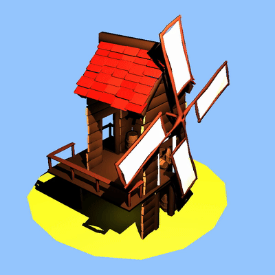 |

## 🌟 Highlights

- **15+ second renders**: Handles massive scenes with thousands of instanced objects
- **Animated sequences**: 360-frame animations with camera paths and light animations
- **Complex materials**: Perfect reflections, realistic glass refraction, and metallic surfaces
- **Optimized performance**: BVH acceleration with 90%+ world bounds rejection rates
- **Multi-threaded rendering**: Parallel processing across CPU cores

## 🎯 Features

### Core Rendering
- **Ray-Surface Intersections**: Spheres, planes, triangles, and complex meshes
- **Advanced Shading**: Ambient, diffuse, and specular lighting with proper shadow calculations
- **Reflections**: Perfect mirror reflections for metallic surfaces
- **Refraction**: Dielectric materials with proper Snell's law implementation
- **Smooth Shading**: Vertex normal interpolation for realistic mesh rendering

### Acceleration & Performance
- **BVH (Bounding Volume Hierarchy)**: Optimized spatial acceleration structure for fast ray-mesh intersections
- **Multi-threading**: Parallel rendering across multiple CPU cores
- **Performance Profiling**: Built-in timing and statistics for optimization
- **Efficient Instancing**: World-space bounds culling for instanced objects

### Transformations & Instancing
- **Full Transformation Pipeline**: Translation, rotation, and scaling with proper matrix operations
- **Mesh Instancing**: Efficient rendering of multiple instances with different transformations
- **Negative Scale Handling**: Correct triangle winding and normal calculations for reflected geometry
- **Animated Cameras**: Camera paths and transformations over time
- **Animated Lights**: Dynamic light positioning and properties

### Scene Management
- **JSON Scene Parsing**: Flexible scene description format
- **PLY File Support**: Direct loading of 3D mesh files
- **Multiple Camera Types**: Perspective and LookAt cameras with configurable FOV
- **Material System**: Support for Lambertian, Phong, and dielectric materials

### Tools & Utilities
- **Benchmark Scripts**: Automated performance measurement and CSV generation
- **Video Generation**: Frame-to-video conversion for animated sequences
- **Metadata Export**: Automatic JSON metadata generation per camera

## 🚀 Building

```bash
make
```

This will compile the raytracer executable.

## 📖 Usage

### Basic Rendering
```bash
./raytracer ../inputs_hw2/scene.json
```

### Command Line Options
```bash
-m: Disable multi-threading
-b: Enable BVH
-c: Disable back face culling
```

## 🎨 Visual Showcase

### Most Impressive Renders

#### Grass Desert (15.2 seconds render time)
The most computationally intensive scene, featuring massive instanced geometry with thousands of grass blades and complex lighting.

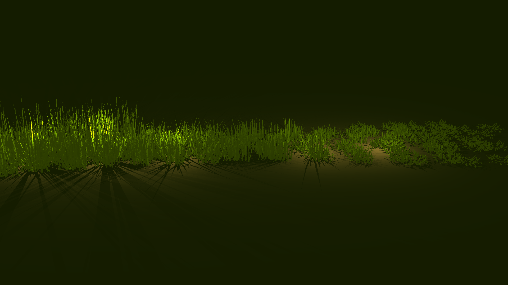

#### Dragon Metal (2.8 seconds total, 615ms preprocess)
Complex mesh with metallic material, showcasing reflections and BVH acceleration.

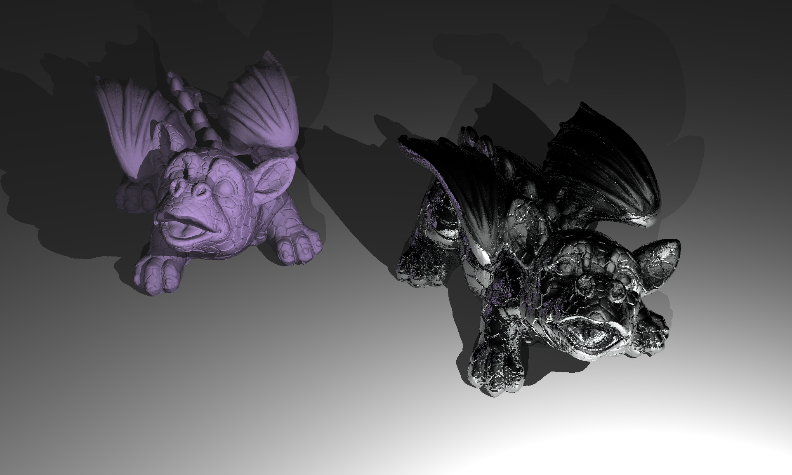

#### Marching Dragons (1.3 seconds total)
Multiple instanced dragons with transformations, demonstrating efficient instancing with world-space bounds culling.

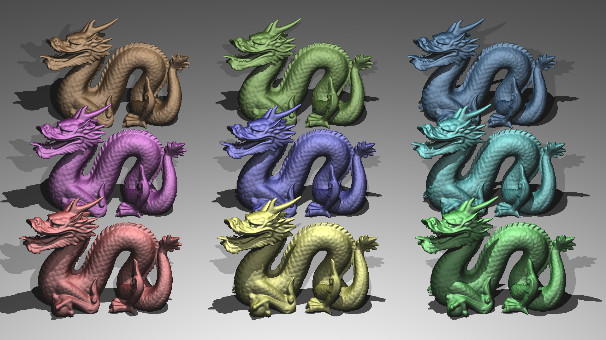

#### Mirror Room (1.1 seconds)
Complex scene with perfect reflections and refractions, showcasing dielectric material implementation.

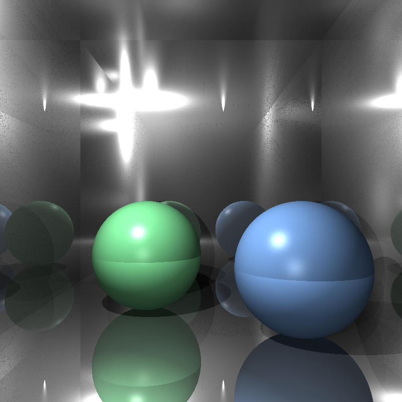

#### Metal Glass Plates (861ms)
Dielectric materials with proper Snell's law refraction and realistic glass rendering.

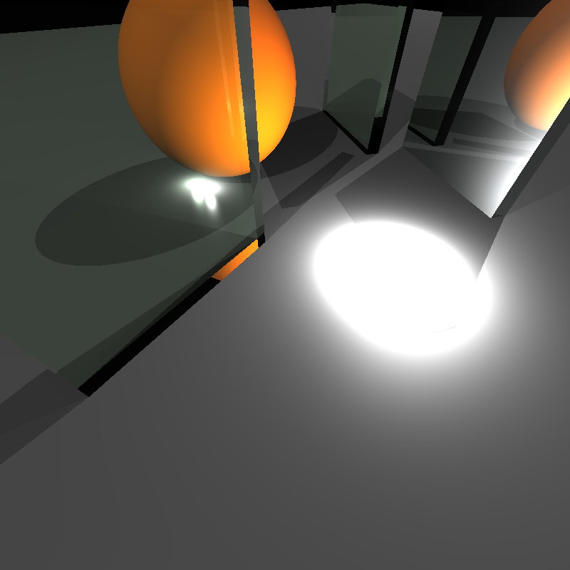

### Animated Sequences

#### Camera Around David (360 frames, ~289ms per frame)
Smooth camera path animation orbiting around the David statue.


#### Camera Zoom (360 frames, ~281ms per frame)
Dynamic camera zoom animation with smooth transitions.

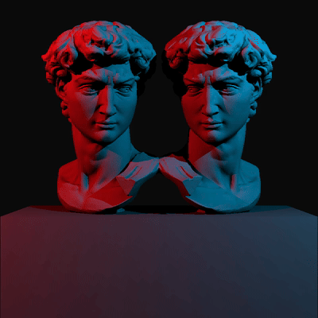

#### Light Animation (360 frames, ~315ms per frame)
Animated light source creating dynamic shadows and highlights.


#### Windmill (360 frames, ~528ms per frame)
Rotating windmill with instanced geometry, demonstrating transformation animations.


## 📊 Performance Highlights

The raytracer includes built-in profiling that provides detailed performance metrics:

```
=== Performance Stats ===
Intersect calls: 695184
BVH traversals: 65536
Triangle tests: 775184
World bounds reject rate: 90.5727%

=== Timing Breakdown (ms) ===
Time in intersect(): 99.074 ms
Time in rayHitsMesh(): 462.72 ms
  - BVH traverse: 34.1818 ms
  - Ray transform: 12.4943 ms
  - AABB tests: 18.4531 ms
```

### Benchmark Results

Below benchmark is created on Macbook Pro M2 Pro while listening to ['Never Gonna Give You Up' by Rick Astley](https://www.youtube.com/watch?v=dQw4w9WgXcQ). It's not a fair benchmark but at least you are rickrolled.

Top performing scenes with their render times and features:

| Scene | Pre-process | Render | Total | Features | Image |
| --- | --- | --- | --- | --- | --- |
| **grass_desert** | 1 ms | **15207 ms** | **15208 ms** | BVH, Multi-thread |  |
| **dragon_metal** | 615 ms | 2208 ms | 2823 ms | BVH, Multi-thread |  |
| **marching_dragons** | 296 ms | 993 ms | 1289 ms | BVH, Multi-thread |  |
| **mirror_room** | 0 ms | 1114 ms | 1114 ms | Multi-thread |  |
| **metal_glass_plates** | 0 ms | 861 ms | 861 ms | Multi-thread |  |
| **glaring_davids** | 25 ms | 334 ms | 359 ms | Multi-thread | 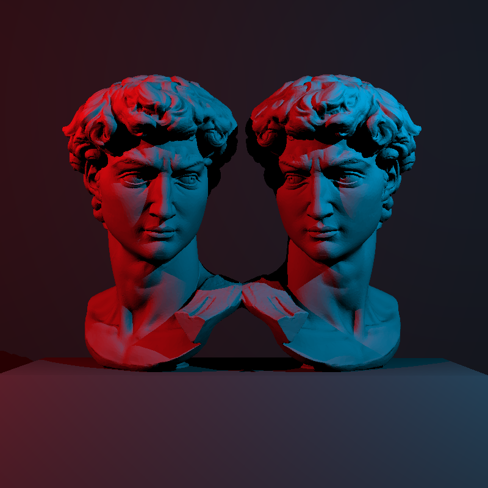 |
| **two_berserkers** | 1 ms | 251 ms | 252 ms | Multi-thread | 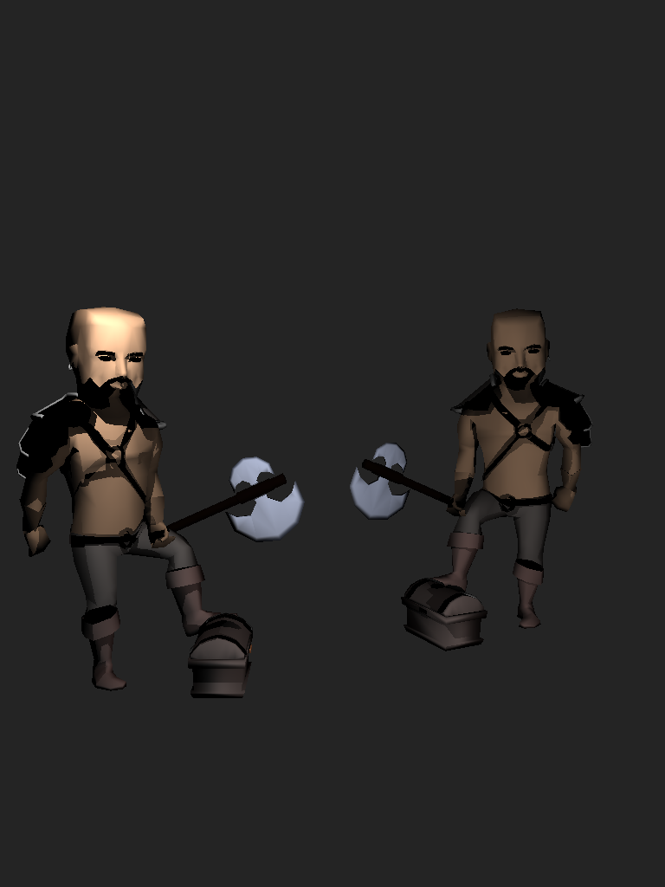 |
| **ellipsoids** | 0 ms | 86 ms | 86 ms | Multi-thread | 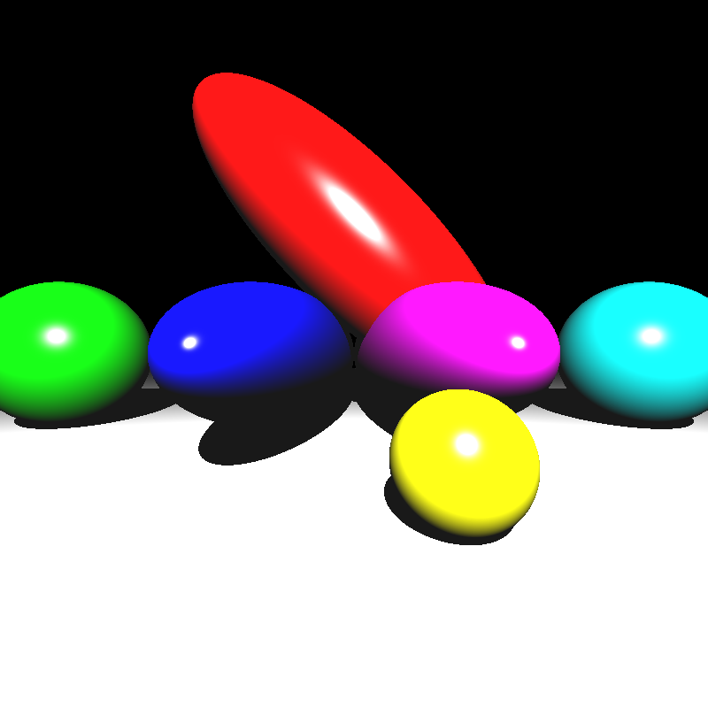 |
| **spheres** | 0 ms | 70 ms | 70 ms | Multi-thread | 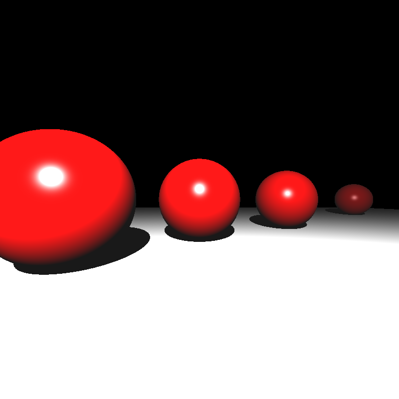 |
| **simple_transform** | 0 ms | 46 ms | 46 ms | Multi-thread | 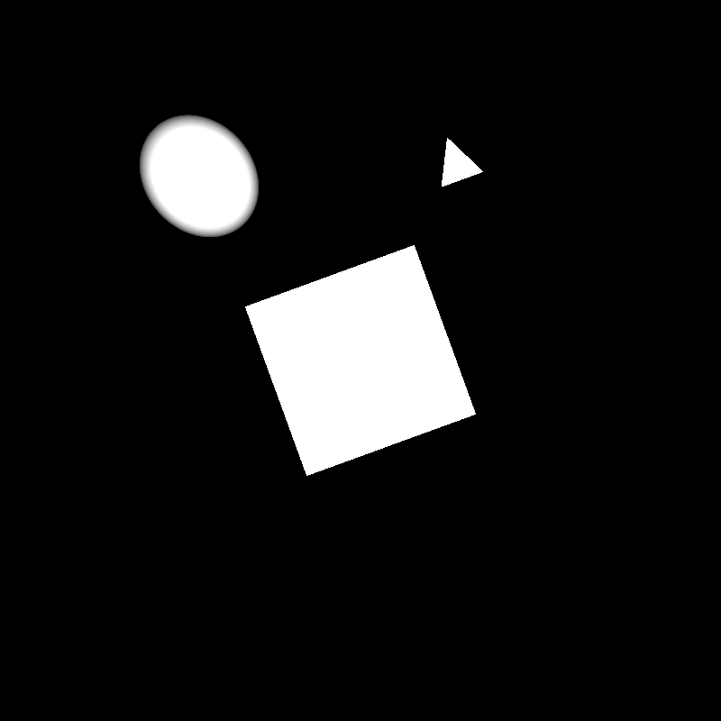 |

## 🏗️ Architecture

The codebase is organized into modular components:

- **`raytracer.cpp`**: Main entry point and ray casting logic
- **`scene.cpp/h`**: Scene parsing, intersection tests, and shading
- **`bvh.cpp/h`**: Bounding Volume Hierarchy implementation
- **`utils.cpp/h`**: Vector operations and utility functions
- **`overloads.cpp/h`**: Vector operator overloads for cleaner code
- **`precompute.cpp/h`**: Determinant precomputation for triangles

## 📝 Documentation

Detailed development journey and technical insights are available in:
- **`blogs/BLOG1.md`**: HW1 implementation journey
- **`blogs/BLOG2.md`**: HW2 transformations and instancing

## 🎓 Course Information

This project was developed for **CENG 795 - Computer Graphics** at Middle East Technical University, Fall 2025.

## 📄 License

See LICENSE file for details.

