# Raytracer - CENG 795 Fall 2025

> **Murat Bayraktar – 2448199**

A high-performance raytracer implemented from scratch in C++ for CENG 795. This project implements a complete raytracing pipeline with advanced features including BVH acceleration, transformations, instancing, sampling, motion blur, depth of field, textures, bump mapping, HDR rendering, and tone mapping.

## 🎬 Animated Showcase

| Camera Animation | Light Animation | Windmill |
| --- | --- | --- |
|  |  | 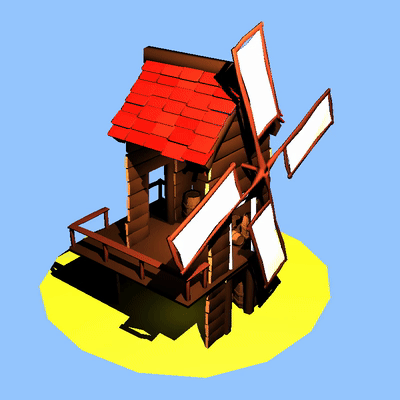 |

## 🖼️ Best Renders

| Glass Sphere with HDR Environment | Wine Glass with Depth of Field | Galactica Dynamic Scene |
| --- | --- | --- |
|  | 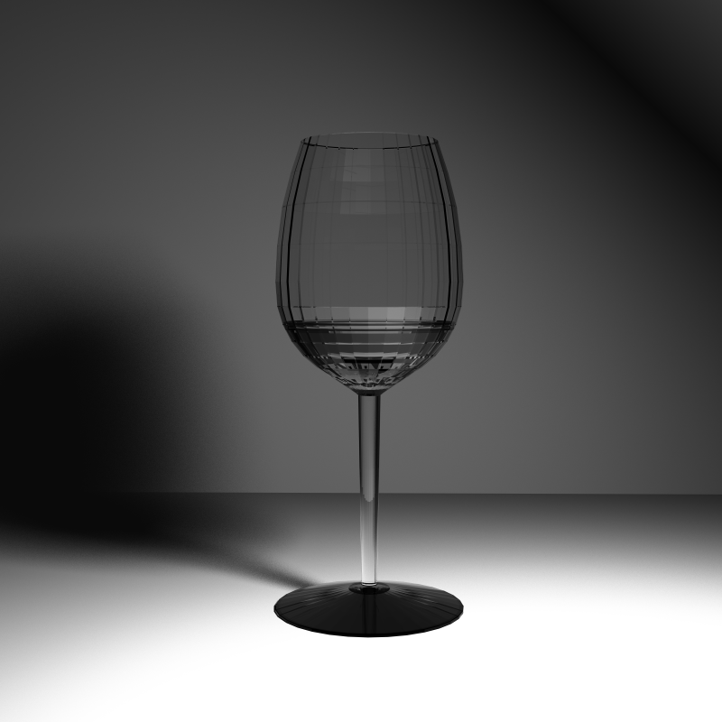 |  |

## 🌟 Highlights

- **Complete raytracing pipeline**: From basic ray-sphere intersections to HDR rendering with tone mapping
- **High-performance rendering**: Handles massive scenes (15+ seconds for complex instanced geometry)
- **Advanced features**: Multi-sampling, depth of field, motion blur, area lights, environment maps
- **Rich material system**: Textures, bump mapping, normal mapping, procedural textures, roughness
- **HDR support**: Full HDR pipeline with EXR/HDR I/O and three tone mapping operators
- **Optimized performance**: BVH acceleration with 90%+ world bounds rejection rates
- **Multi-threaded rendering**: Parallel processing across CPU cores
- **Progressive GUI**: Real-time rendering visualization for debugging and monitoring
- **Animated sequences**: 360-frame animations with camera paths and light animations

## 🎯 Features

### Core Rendering
- **Ray-Surface Intersections**: Spheres, planes, triangles, and complex meshes
- **Advanced Shading**: Ambient, diffuse, and specular lighting with proper shadow calculations
- **Reflections**: Perfect mirror reflections for metallic surfaces
- **Refraction**: Dielectric materials with proper Snell's law implementation
- **Smooth Shading**: Vertex normal interpolation for realistic mesh rendering
- **Conductor Materials**: Metallic surfaces with Fresnel reflections

### Acceleration & Performance
- **BVH (Bounding Volume Hierarchy)**: Optimized spatial acceleration structure for fast ray-mesh intersections
- **Multi-threading**: Parallel rendering across multiple CPU cores
- **Performance Profiling**: Built-in timing and statistics for optimization
- **Efficient Instancing**: World-space bounds culling for instanced objects (90%+ rejection rates)

### Transformations & Instancing
- **Full Transformation Pipeline**: Translation, rotation, and scaling with proper matrix operations
- **Mesh Instancing**: Efficient rendering of multiple instances with different transformations
- **Negative Scale Handling**: Correct triangle winding and normal calculations for reflected geometry
- **Animated Cameras**: Camera paths and transformations over time
- **Animated Lights**: Dynamic light positioning and properties

### Sampling & Advanced Rendering
- **Jittered Multi-Sampling**: Anti-aliasing with configurable sample counts
- **Aperture & Depth of Field**: Realistic camera focus effects with square aperture
- **Area Lights**: Physically-based square area lights with proper integration
- **Motion Blur**: Time-dependent transforms with object-local correction
- **Roughness-based Reflections**: Stochastic reflections/refractions for realistic material appearance
- **Progressive Rendering**: Iterative rendering with real-time GUI visualization
- **Image-Plane Clipping**: Proper per-ray clipping for objects between camera and image plane

### Textures & Materials
- **Image Texturing**: Nearest, bilinear, and trilinear interpolation
- **Bump Mapping**: Height-based normal perturbation for surface detail
- **Normal Mapping**: Direct normal map support for detailed surfaces
- **Procedural Textures**: Perlin noise and checkerboard patterns
- **Background Textures**: `replace_background` and `replace_all` modes
- **UV Coordinate Handling**: Proper wrapping and face offset support
- **Normalizer Field Support**: Handling textures with custom value ranges

### HDR & Advanced Lighting
- **HDR Image Support**: EXR and HDR format loading and writing
- **Tone Mapping**: Photographic (Reinhard), Filmic, and ACES operators
- **Environment Lights**: HDR environment map lighting with cosine-weighted sampling
- **Directional Lights**: Sun-like directional light sources
- **Spot Lights**: Configurable spotlight with falloff angles
- **Float Buffer Pipeline**: Full HDR rendering pipeline with proper radiance handling

### Scene Management
- **JSON Scene Parsing**: Flexible scene description format
- **PLY File Support**: Direct loading of 3D mesh files
- **Multiple Camera Types**: Perspective and LookAt cameras with configurable FOV
- **Material System**: Support for Lambertian, Phong, dielectric, conductor, and textured materials

### Tools & Utilities
- **Benchmark Scripts**: Automated performance measurement and CSV generation
- **Video Generation**: Frame-to-video conversion for animated sequences
- **Metadata Export**: Automatic JSON metadata generation per camera
- **Progressive GUI**: Real-time rendering visualization window

## 🚀 Building

```bash
make
```

This will compile the raytracer executable.

## 📖 Usage

### Basic Rendering
```bash
./raytracer ../inputs_hw2/scene.json
```

### Command Line Options
```bash
-m: Disable multi-threading
-b: Enable BVH acceleration
-c: Disable back face culling
```

### Progressive Rendering with GUI

The raytracer includes a progressive rendering mode with a real-time GUI window that updates as the image converges. This feature allows you to watch the renderer clean up noise in real-time:

```bash
./raytracer ../inputs_hw3/scene.json
```

The GUI window will:
- Display the current render state as it progresses
- Update iteratively as more samples are accumulated
- Show intermediate frames during multi-sample rendering
- Allow you to monitor convergence and quality in real-time

The progressive renderer:
- Precomputes sample buffers (jitter + time + noise dimensions)
- Accumulates samples into a float buffer
- Periodically dumps iterative frames to disk
- Updates the GUI window for visual feedback

This is particularly useful for:
- Debugging rendering issues in real-time
- Monitoring long renders without waiting for completion
- Adjusting sample counts and seeing immediate results
- Understanding how multi-sampling reduces noise

Watch the progressive renderer clean up noise in real-time:

| Chess Scene Convergence | Deadmau5 Scene Convergence |
| --- | --- |
| 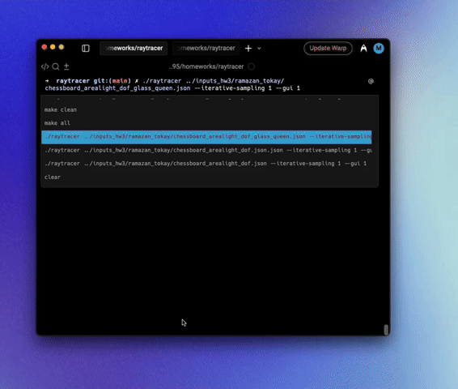 | 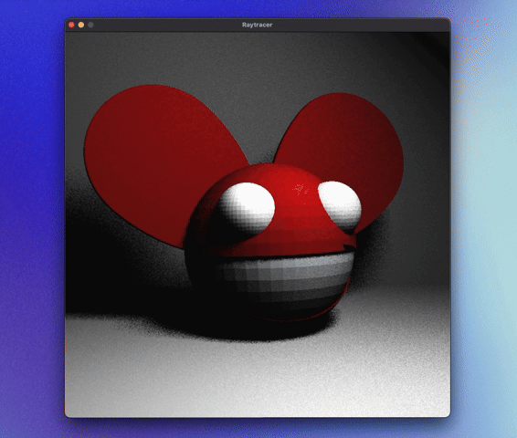 |

## 🎨 Visual Showcase

### Best Renders by Category

#### Foundations
| Scene | Description | Image |
| --- | --- | --- |
| **Science Tree Glass** | Complex mesh with dielectric refraction, showcasing proper Snell's law implementation | 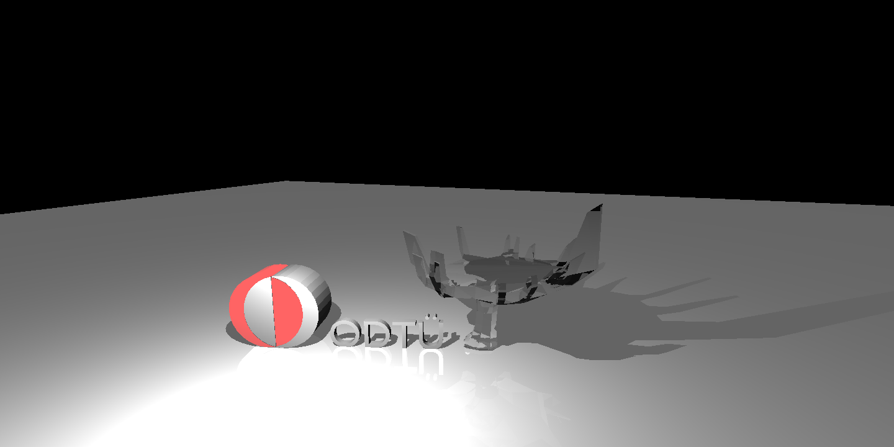 |
| **Cornell Box Recursive** | Classic Cornell box with recursive reflections and refractions | 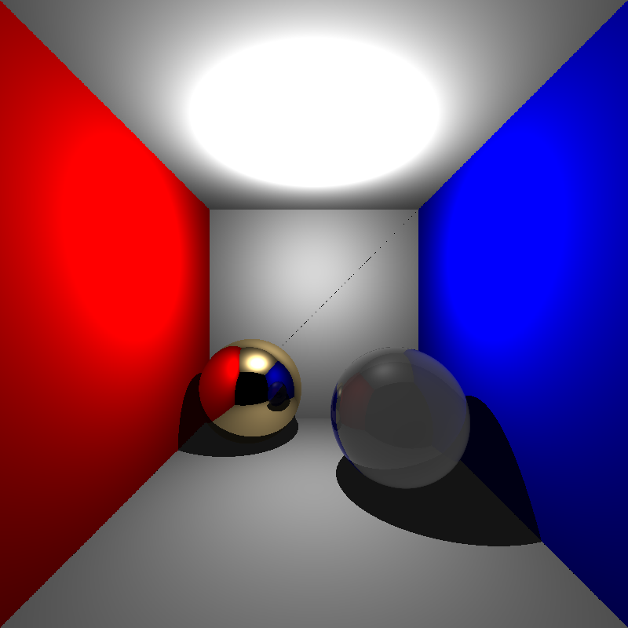 |
| **Spheres Mirror** | Perfect mirror reflections demonstrating the reflection pipeline | 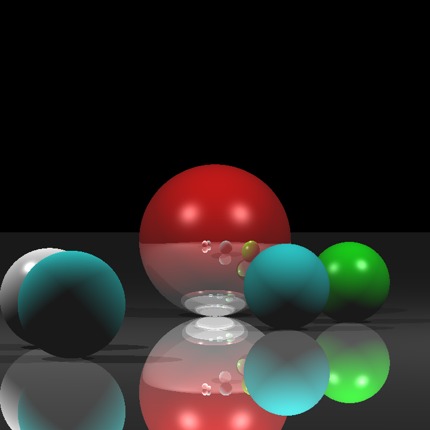 |
| **Bunny with Plane** | Stanford bunny with shadows and smooth shading | 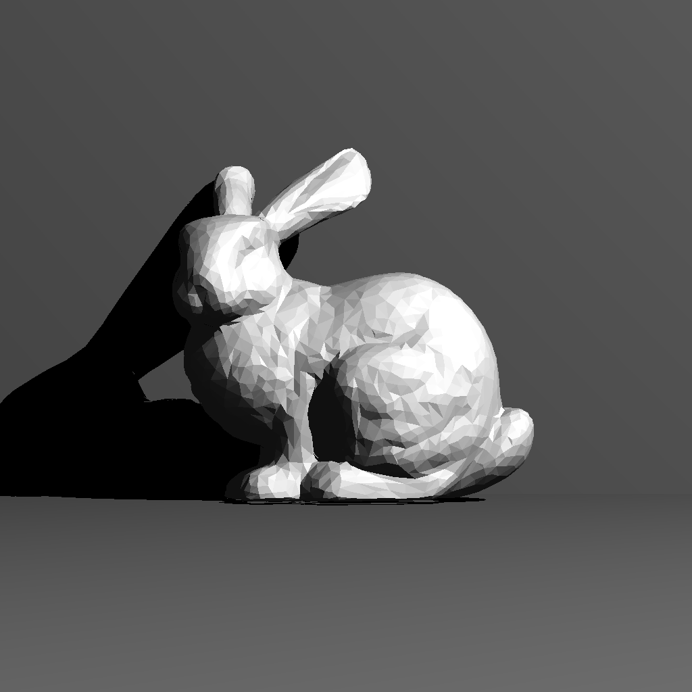 |

#### Transformations & Instancing
| Scene | Description | Image |
| --- | --- | --- |
| **Grass Desert** | Most computationally intensive scene (15.2s), featuring massive instanced geometry with thousands of grass blades | 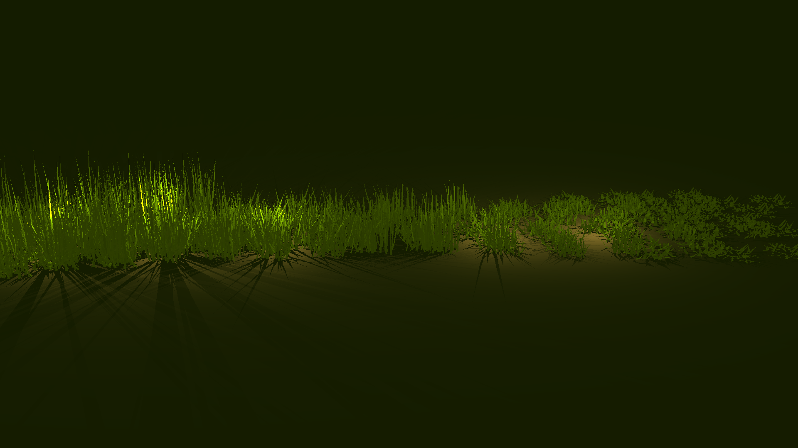 |
| **Dragon Metal** | Complex mesh with metallic material, showcasing reflections and BVH acceleration (2.8s total) | 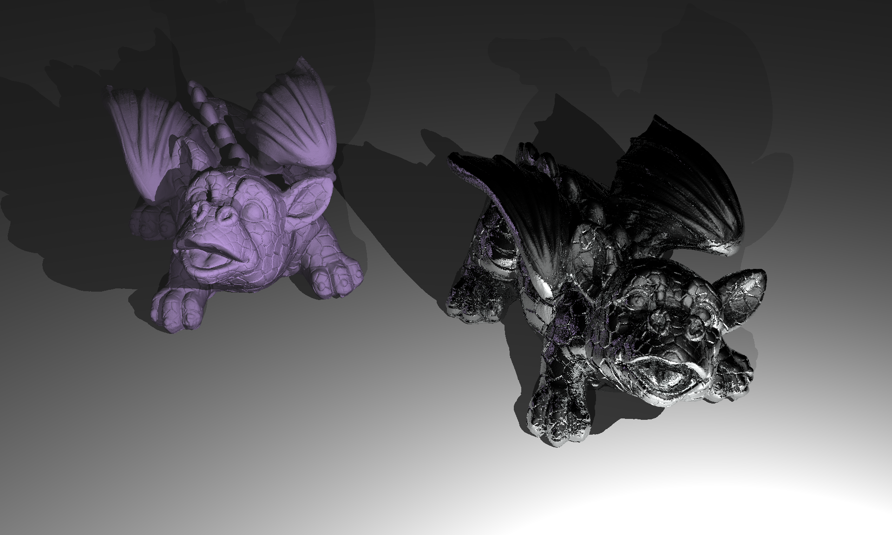 |
| **Marching Dragons** | Multiple instanced dragons with transformations, demonstrating efficient instancing (1.3s total) | 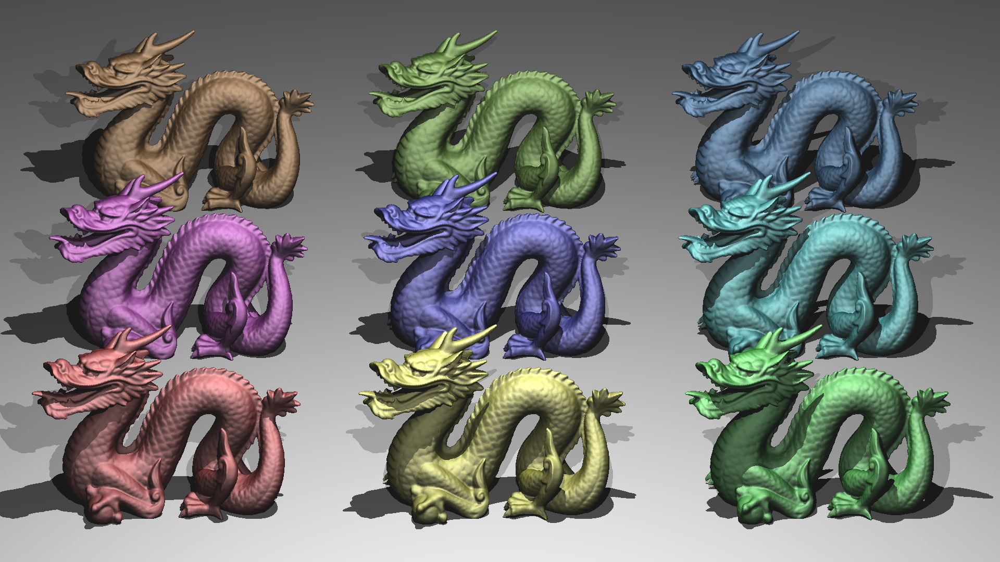 |
| **Metal Glass Plates** | Dielectric materials with proper Snell's law refraction and realistic glass rendering (861ms) | 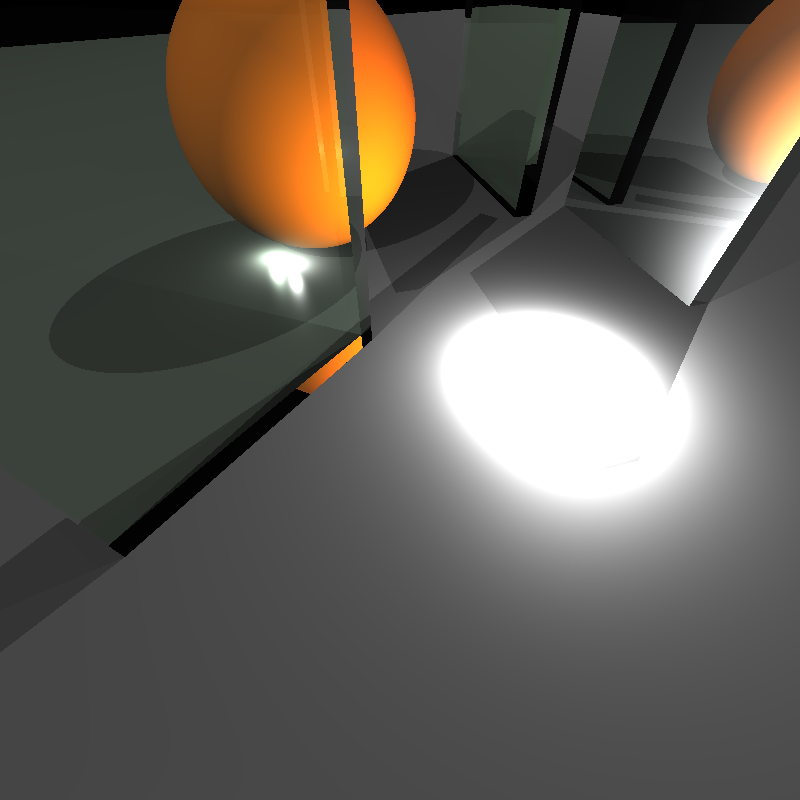 |

#### Sampling & Advanced Rendering
| Scene | Description | Image |
| --- | --- | --- |
| **Wine Glass** | Complex glass object with depth of field, area lights, and multi-sampling |  |
| **Chessboard DOF Glass Queen** | Depth of field with glass materials and area lighting | 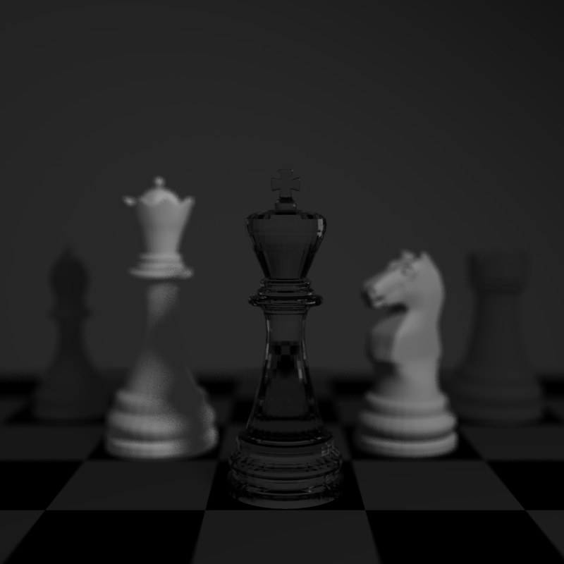 |
| **Deadmau5** | Complex scene with motion blur and multi-sampling | 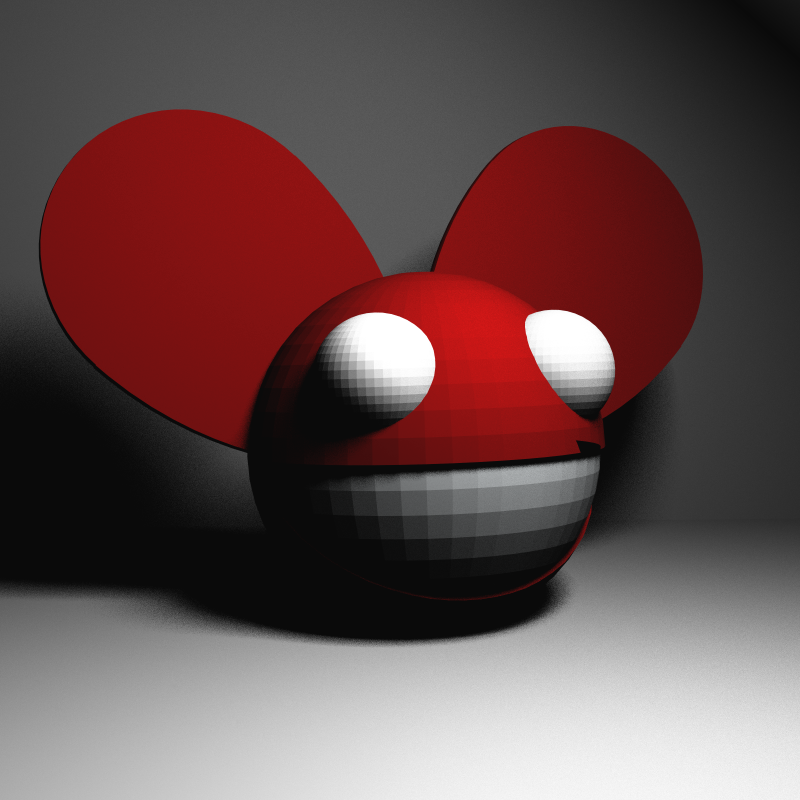 |
| **Focusing Dragons** | Depth of field demonstration with dragon models | 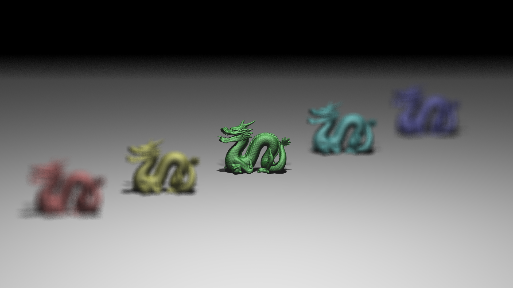 |
| **Cornell Box Brushed Metal** | Roughness-based stochastic reflections creating realistic brushed metal appearance | 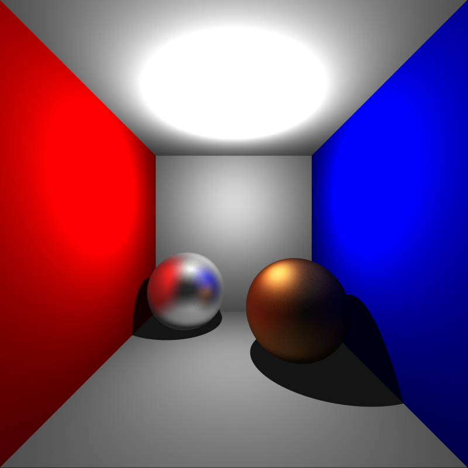 |

#### Textures & Materials
| Scene | Description | Image |
| --- | --- | --- |
| **Wood Box** | Complex textured scene with bump mapping and multiple texture types |  |
| **Veach Ajar** | Classic test scene with wood textures, paintings, and complex material interactions |  |
| **Killeroo Bump Walls** | Cornell box with bump-mapped walls demonstrating normal perturbation |  |
| **Galactica Dynamic** | Large scene with procedural textures and transformations |  |
| **Perlin Bump Cube** | Procedural Perlin noise bump mapping |  |

#### HDR & Advanced Lighting
| Scene | Description | Image |
| --- | --- | --- |
| **Glass Sphere Environment** | HDR environment map lighting with glass refraction |  |
| **Veach Ajar ACES** | Classic scene with ACES tone mapping for cinematic look |  |
| **Teapot Roughness** | Complex teapot with roughness-based reflections and HDR rendering |  |
| **Dragon with Spot Light** | Dragon model with spotlight illumination |  |

### Animated Sequences

#### Camera Around David (360 frames, ~289ms per frame)
Smooth camera path animation orbiting around the David statue.


#### Camera Zoom (360 frames, ~281ms per frame)
Dynamic camera zoom animation with smooth transitions.

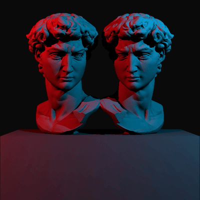

#### Light Animation (360 frames, ~315ms per frame)
Animated light source creating dynamic shadows and highlights.


#### Windmill (360 frames, ~528ms per frame)
Rotating windmill with instanced geometry, demonstrating transformation animations.


## 📊 Performance Highlights

The raytracer includes built-in profiling that provides detailed performance metrics:

```
=== Performance Stats ===
Intersect calls: 695184
BVH traversals: 65536
Triangle tests: 775184
World bounds reject rate: 90.5727%

=== Timing Breakdown (ms) ===
Time in intersect(): 99.074 ms
Time in rayHitsMesh(): 462.72 ms
  - BVH traverse: 34.1818 ms
  - Ray transform: 12.4943 ms
  - AABB tests: 18.4531 ms
```

### Benchmark Results

Benchmarks created on MacBook Pro M2 Pro. All results use BVH acceleration and multi-threading unless otherwise noted.

#### Transformations & Instancing
| Scene | Pre-process | Render | Total | Features | Image |
| --- | --- | --- | --- | --- | --- |
| **grass_desert** | 1 ms | **15207 ms** | **15208 ms** | Instancing, BVH |  |
| **dragon_metal** | 615 ms | 2208 ms | 2823 ms | Complex mesh, BVH |  |
| **marching_dragons** | 296 ms | 993 ms | 1289 ms | Instancing, BVH |  |
| **metal_glass_plates** | 0 ms | 861 ms | 861 ms | Dielectric materials |  |

#### Sampling & Advanced Rendering
| Scene | Pre-process | Render | Total | Features | Image |
| --- | --- | --- | --- | --- | --- |
| **wine_glass** | 0 ms | **1,691,977 ms** | **1,691,977 ms** | Multi-sampling, DOF, Area lights |  |
| **dragon_dynamic** | 605 ms | 215,664 ms | 216,269 ms | Motion blur, Multi-sampling | 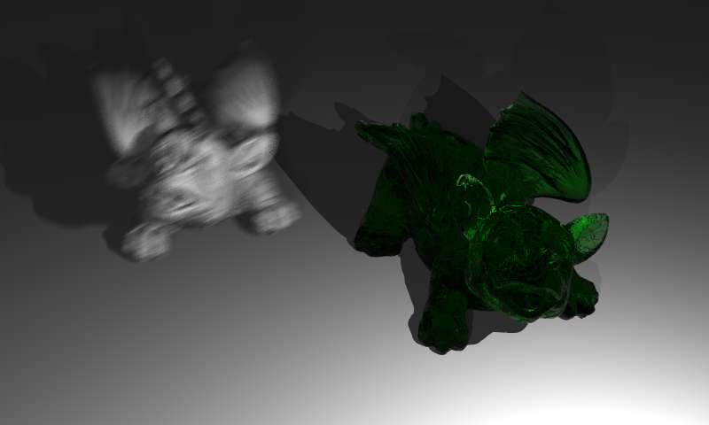 |
| **chessboard_dof_glass** | 9 ms | 64,921 ms | 64,930 ms | DOF, Glass, Area lights |  |
| **cornellbox_brushed_metal** | 0 ms | 32,611 ms | 32,611 ms | Roughness, Stochastic reflections |  |

#### Textures & Materials
| Scene | Pre-process | Render | Total | Features | Image |
| --- | --- | --- | --- | --- | --- |
| **galactica_dynamic** | 0 ms | 56,419 ms | 56,419 ms | Procedural textures, Transformations |  |
| **VeachAjar** | 41 ms | 4,116 ms | 4,157 ms | Complex textures, Bump mapping |  |
| **killeroo_bump_walls** | 25 ms | 3,844 ms | 3,869 ms | Bump mapping, Textures |  |

#### HDR & Advanced Lighting
| Scene | Pre-process | Render | Total | Features | Image |
| --- | --- | --- | --- | --- | --- |
| **teapot_roughness_phot** | 3 ms | 100,342 ms | 101,234 ms | HDR, Tone mapping, Roughness |  |
| **glass_sphere_env** | 0 ms | 107,223 ms | 107,223 ms | Environment lights, HDR |  |
| **VeachAjar (HDR)** | 39 ms | 33,097 ms | 33,136 ms | HDR, ACES tone mapping |  |

## 🏗️ Architecture

The codebase is organized into modular components:

### Core Rendering
- **`raytracer.cpp`**: Main entry point, ray casting logic, and progressive rendering GUI
- **`scene.cpp/h`**: Scene parsing, intersection tests, shading, material evaluation, and light sampling
- **`bvh.cpp/h`**: Bounding Volume Hierarchy implementation with optimized traversal
- **`utils.cpp/h`**: Vector operations, matrix math, and utility functions
- **`overloads.cpp/h`**: Vector operator overloads for cleaner mathematical code
- **`precompute.cpp/h`**: Determinant precomputation for triangles (object-space and world-space)

### Textures & Materials
- **`texture.cpp/h`**: Image loading (LDR/HDR), texture sampling (nearest/bilinear/trilinear), UV mapping, bump mapping, normal mapping, and procedural textures

### HDR & Tone Mapping
- **`hdr_io.cpp/h`**: HDR/EXR image loading and writing using TinyEXR and custom HDR readers
- **`tonemap.cpp/h`**: Tone mapping operators (Photographic/Reinhard, Filmic, ACES)

### External Libraries
- **`tinyexr.h`**: EXR format support
- **`stb_image.h`**: PNG/JPEG image loading
- **`stb_image_write.h`**: PNG image writing
- **`happly.h`**: PLY file parsing
- **`json.hpp`**: JSON scene file parsing

### Rendering Pipeline

1. **Scene Loading**: Parse JSON scene files, load meshes (PLY), textures, and materials
2. **Preprocessing**: Build BVH structures, precompute triangle determinants, compute world-space bounds for instances
3. **Ray Generation**: Primary rays with jittered sampling, depth of field, and motion blur time sampling
4. **Intersection Testing**: BVH traversal, ray-triangle/ray-sphere/ray-plane intersections with proper coordinate space handling
5. **Shading**: Material evaluation (diffuse, specular, mirror, dielectric, conductor), texture sampling, bump/normal mapping
6. **Lighting**: Point, area, directional, spot, and environment light sampling with proper Monte Carlo integration
7. **Tone Mapping**: Convert HDR radiance to displayable LDR values (if specified)
8. **Output**: Write PNG (LDR) or EXR/HDR (HDR) files

### Key Design Decisions

- **Float buffers**: Moved from `unsigned char*` to `float*` for proper HDR support
- **Progressive rendering**: Iterative accumulation with GUI updates for real-time feedback
- **World-space consistency**: All intersection comparisons use world-space distances to handle transformations correctly
- **Modular material system**: Each material type (diffuse, specular, mirror, dielectric, conductor) has separate evaluation paths
- **Efficient instancing**: World-space bounds culling before transforming rays to object space

## 📝 Documentation

Detailed development journey and technical insights are available in the blog posts:
- **`blogs/BLOG1.md`**: Foundations: Basic raytracing, intersections, shading, reflections, refractions, BVH implementation
- **`blogs/BLOG2.md`**: Transformations & Instancing: Matrix operations, mesh instancing, animated cameras/lights, performance optimizations
- **`blogs/BLOG3.md`**: Sampling & Advanced Rendering: Multi-sampling, depth of field, area lights, motion blur, roughness, progressive GUI
- **`blogs/BLOG4.md`**: Textures & Materials: Image texturing, bump mapping, normal mapping, procedural textures, UV coordinate handling
- **`blogs/BLOG5.md`**: HDR & Advanced Lighting: HDR rendering, tone mapping, environment lights, directional/spot lights, float buffer pipeline

Each blog post includes:
- Technical implementation details
- Bug fixes and debugging stories
- Performance benchmarks
- Visual comparisons (before/after fixes)
- Lessons learned

## 🎓 Course Information

This project was developed for **CENG 795 - Computer Graphics** at Middle East Technical University, Fall 2025.

## 📄 License

See LICENSE file for details.

