# My Raytracer Journey - Fall 2025 CENG 795 HW 1 Blog

> Murat Bayraktar - 2448199

> I wrote a raytracer from scratch in C++ for CENG 795 HW1. This post is a cleaned-up story of that journey (details live in `DIARY1.md`), plus a bunch of results and comparisons.

## TL;DR:

#### What's done and what's not?
My main goal was simple in this assignment. I wanted to implement basics and delay the complex parts i.e. acceleration structures until I actually needed them. I implemented all the features except I failed at two things: 
- [ ] Dielectric: I did this on the last day of the assignment and the bug I was trying to fix was a bit tricky and somehow I was very overwhelmed near the deadline. So this one is not perfect yet it produces similar results to the ground truth.
- [ ] BVH: `lobster.json` was taking forever to render even with multi-threading enabled. So I tried implementing BVH but funny that my BVH is buggy and it doesn't always produce correct results. In other words it works for `bunny.json` but it misses the simple objects in `cornellbox.json`. This is very strange behavior and I will investigate it more in the second homework.

#### How to run?
In order to test the stuff I implemented I made my code modular. As instructed in the homework you can still run my code with `./raytracer ../inputs/scene.json` command. However, if you want to test the stuff I implemented you can run `./raytracer ../inputs/scene.json -m 1 -b 0 -c 1` command. This will disable multi-threading and BVH and enable back face culling which is the default settings for now.

```
-m: Disable multi-threading
-b: Enable BVH
-c: Disable back face culling
```

Before I show you what my benchmark and results look like, I want to mention a bit about my journey in the next section which follows from the `DIARY1.md` file but in a more organized way.

# The Journey

## Starting Out: Parsing and Basic Setup

I began by parsing the scene files and getting a basic structure in place. At first, I just wrote a constant color to each pixel — "Woah! 2 for loops for writing an image? I'm a genius!" — but that didn't last long.

One early gotcha: I misunderstood how faces and vertices work. Vertex data is a list of vertices, and faces are indices into that list. I was trying to parse faces as actual vertices, which obviously didn't work. Also, the JSON files use 1-based indexing while C++ arrays are 0-based, so I had to add `-1` everywhere when accessing vertices. That one caused me some headaches later when things were rendering in the wrong places.

As my `scene.cpp` grew, I split things up into `utils.h`, `overloads.h`, and `precompute.h`. I'm glad I did that early because operator overloading for vectors saved me a ton of lines later. Just basic stuff — addition, subtraction, multiplication, cross product, dot product, normalization — but it made all the intersection math way cleaner.

```cpp
// Vector overloads are blessing for me because I could do below in one line
// wr = -wo + 2n(n.wo)
VectorFloatTriplet wr = ray.direction - 2 * dotProduct(ray.direction, normal) * normal; // reflection formula

// Or we could precompute the triangle normal
VectorFloatTriplet normal = normalize(crossProduct(v1 - v0, v2 - v0)); // triangle normal
```

## Casting Rays and First Intersections

Around October 24th, I finally got around to implementing `castRay`. I followed slide 15 from the lecture notes pretty much verbatim. For each pixel, I compute the ray direction using the camera's position, gaze direction, and the near plane.

Nothing fancy, but it worked. I added `Ray` and `Intersection` structs to `scene.h` to keep track of rays and where they hit stuff.

## The Sign Error

October 26th was when I got sphere and plane intersections working. The math was straightforward from the lecture slides, but here's the fun part: I spent way too long debugging why my spheres looked weird. Turns out I had a sign error in the discriminant calculation.

The correct formula is:
```
D = (d·(o-c))² - (d·d)·((o-c)·(o-c) - r²)
```

I had written:
```
D = (d·(o-c))² - (d·d)·((o-c)·(o-c) + r²)
```

Just a minus instead of a plus. lol.

I also cleaned up the sphere intersection code to just take `min(t1, t2)` instead of checking both intersections separately. Because I wasn't doing that initially, I wasted a couple hours debugging why my spheres looked creepy.
| Forgot t1/t2 logic | Correct result |
| --- | --- |
| 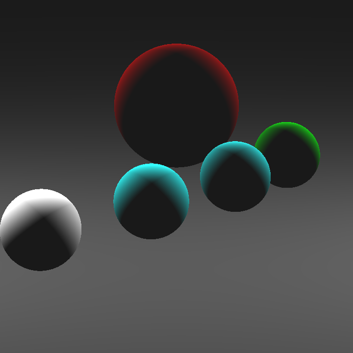 |  |

Eventually the spheres with plane scene started rendering correctly with proper lighting and specular highlights. Pretty happy with that.


## Shading: When Everything Went Dark

Okay so this was the big one. I implemented `computeShading` with ambient, diffuse, and specular components. But when I rendered scenes, I was only getting the ambient color. Everything looked super dark and flat.

My diffuse and specular calculations were basically being skipped. Facepalm moment for sure.

Fixed it by removing a redundant check — I was already using `max(0.0f, ...)` for the dot products anyway, so the extra check was killing everything.

Here's the progression on the `simple.json` scene:

| Working on specular and diffuse | Nearly correct |
| --- | --- |
| 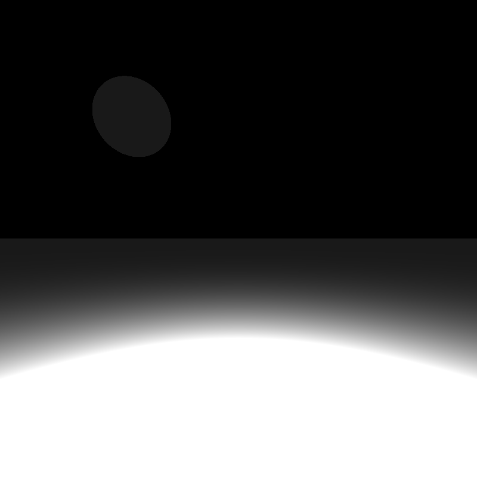 | 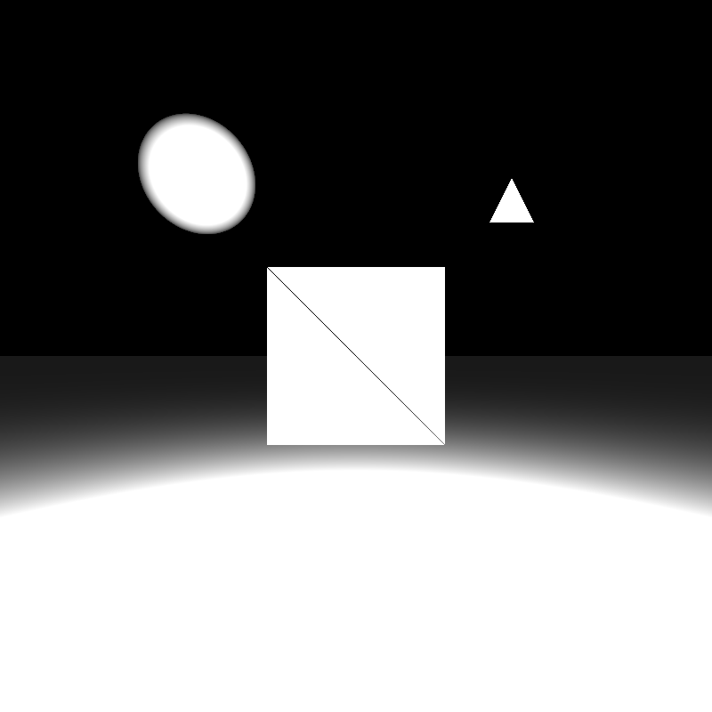 |

And the final result:


## Triangle Intersection: The Barycentric Journey

For the last couple hours of October 26th, I worked on implementing ray-triangle intersection. There were two main methods I could have used — the lengthy method or barycentric coordinates. I thought using barycentric coordinates would allow me to early quit with some checks.

I wrote down the full math in my code comments. The idea is to go from the area of the triangle to the barycentric coordinates of the intersection point:

```
beta = | ax-ox ax-cx dx |
       | ay-oy ay-cy dy |
       | az-oz az-cz dz |
       -------------------
              |area|

gamma = | ax-bx ax-ox dx |
        | ay-by ay-oy dy |
        | az-bz az-oz dz |
        -------------------
               |area|

alpha = 1 - beta - gamma
```

For the `t` calculation, replacing the first column with `o-a`:
```
determinantT = | ax-bx ax-cx ax-ox |
               | ay-by ay-cy ay-oy |
               | az-bz az-cz az-oz |

t = determinantT / |area|
```

Now, I had this thought while implementing: I noticed that for calculating the determinant for `t`, we were only using the origin and triangle vertices. I thought I could precompute this since the origin would be constant! But then I realized — when reflecting rays, I'd be sending a new ray with a new origin and direction, so precomputing would break. I'm glad I wrote this down because otherwise I wouldn't have caught that before it became a problem.

## The Creepy Bunny and Other Debugging Adventures

After getting triangle intersection working, I moved on to mesh intersection — basically just looping through triangle faces. But here's the bug that gave me the creepy bunny:

As soon as I found an intersection in the mesh check, I was returning `true` immediately. This caused my bunny to look... well, creepy.

| Creepy bunny | Fixed bunny |
| --- | --- |
| 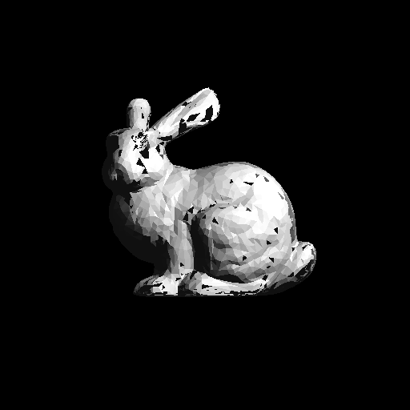 | 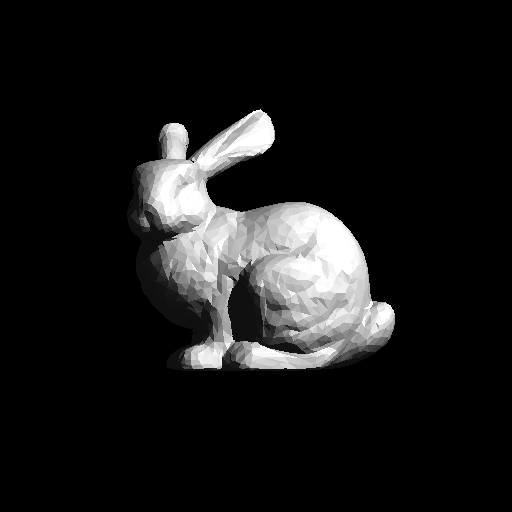 |

There was also an issue with the `simple.json` scene. It was rendering "almost correctly" but not quite. Turned out to be the intersection test epsilon I was using for the `beta` and `gamma` checks. Once I fixed that, it looked good.

| Wrong determinant | Nearly correct |
| --- | --- |
| 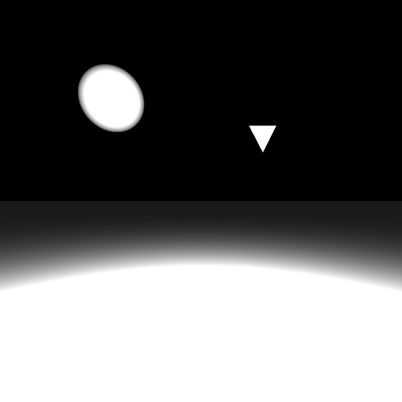 |  |

And I had camera issues too. Some scenes were rendering from completely wrong angles. This was because I wasn't handling non-perpendicular gaze and up vectors correctly, and I hadn't implemented the `lookAt` camera type yet.

| Broken camera view | Fixed view |
| --- | --- |
|  | 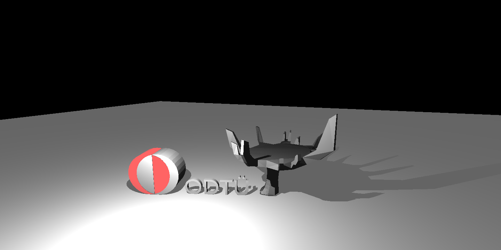 |

I also had another sphere bug where I forgot the `t1`/`t2` logic and was taking the wrong intersection. That looked weird:

| Forgot t1/t2 logic | Correct result |
| --- | --- |
|  |  |

## Shadows and Reflections

Shadow rays were actually straightforward once I had the intersection logic working. I just used the `intersect()` function to check if there's anything blocking the path from the hit point to the light. I updated the `Ray` struct to include a shadow ray flag, and used it inside `rayHitsTriangle` to decide whether to calculate the determinant on the fly or not.

Reflection was similarly straightforward once the foundation was solid. The usual formula: `r = d - 2(d·n)n`. My raytracer now works with `spheres_mirror.json` and it mostly looks correct, though there's a tiny difference where the big ball touches the plane — it doesn't have quite enough whiteness compared to the ground truth. Could be floating point issues, could be something more serious. I'll investigate that later.

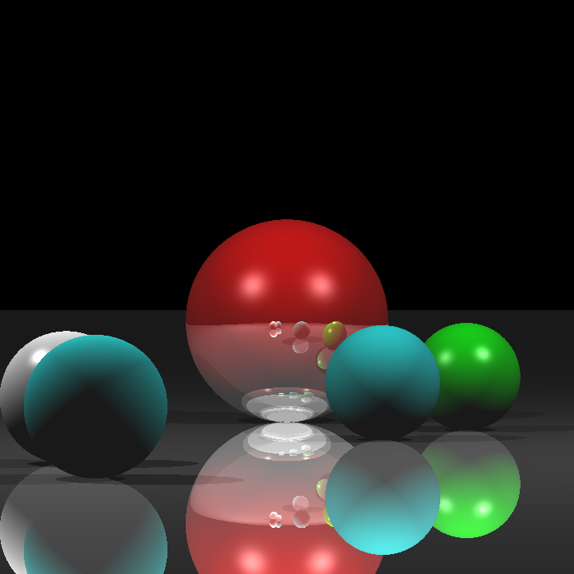

Here's the bunny with a plane to show the shadow:

| First attempt | Final |
| --- | --- |
| 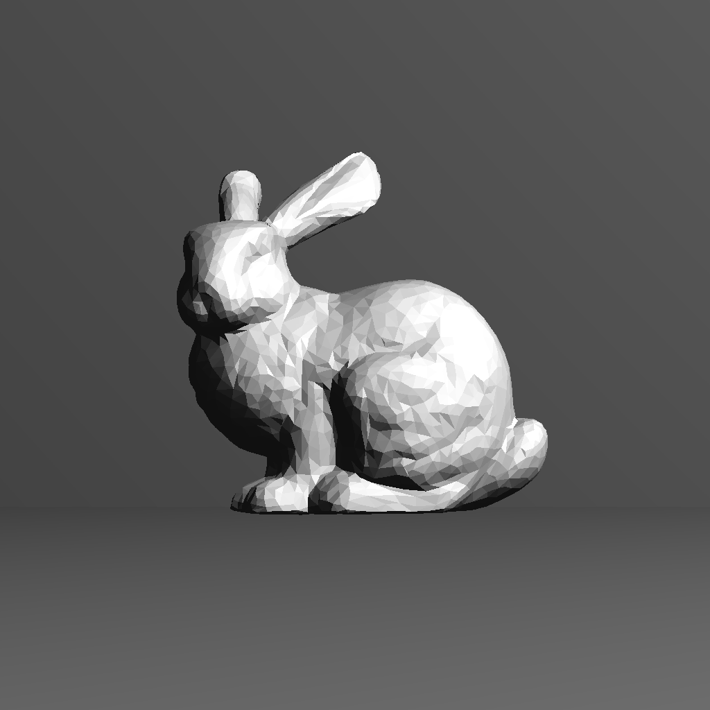 | 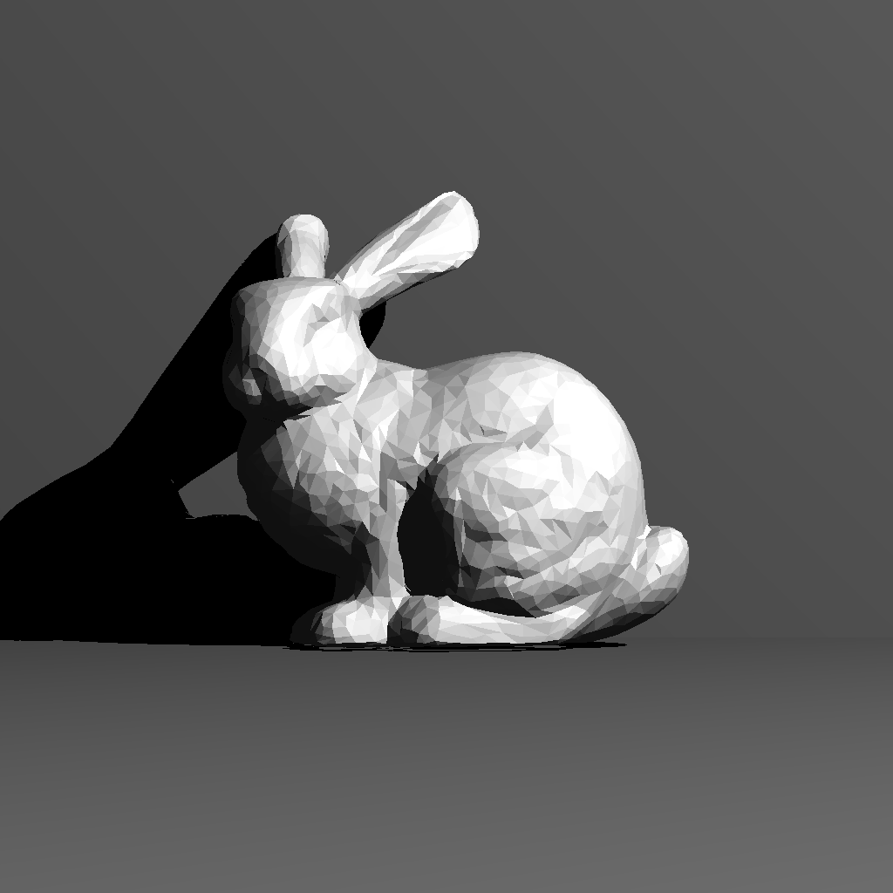 |


## Smooth vs Flat Shading

While looking at scene files near the deadline, I realized I'd forgotten to implement smooth shading. So I added that functionality. The difference is pretty dramatic:

| Flat/Messed | Smooth |
| --- | --- |
| 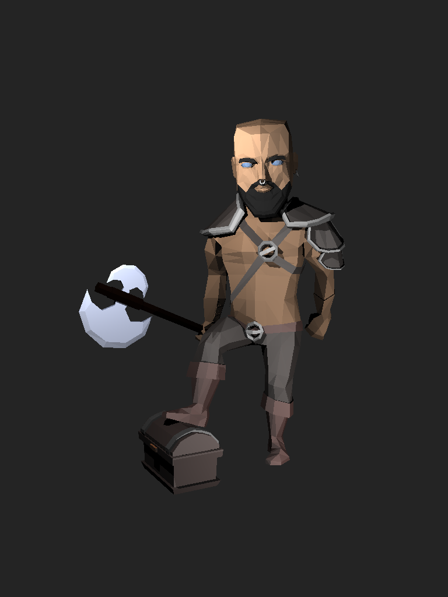 |  |
| 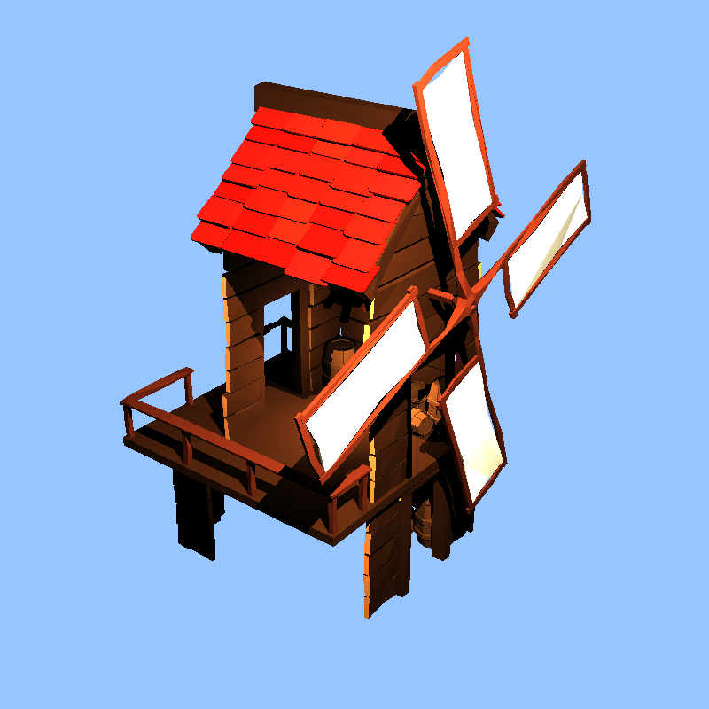 | 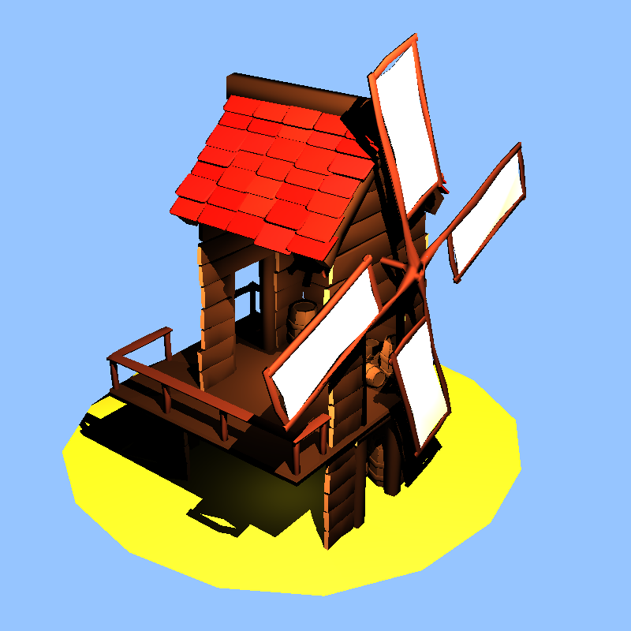 |

For smooth shading, I interpolate vertex normals using the barycentric coordinates I already had. It made the meshes look way more realistic.

## The Performance Problem

By October 28th, I had implemented camera fixes and PLY file parsing. But these scenes were taking forever to render, even on my 10-core M2 Pro. Threading helped a bit, but as scenes grew, render time increased significantly. I knew I'd need an acceleration structure.

The `lobster.json` scene was particularly brutal — taking way too long even with multi-threading enabled.


## BVH: The Buggy Acceleration Structure

On the last day (October 29th), I implemented BVH because threading alone wasn't cutting it for big scenes. I chose BVH because it fit my mental model better than other structures.

The implementation works... sometimes. For `bunny.json`, it works perfectly. But for `cornellbox.json`, the meshes just disappear. Very interesting case. And for the Chinese dragon example, I skip nearly all objects and it only looks like a scatter of points.

| Without BVH | With BVH (buggy) |
| --- | --- |
|  | 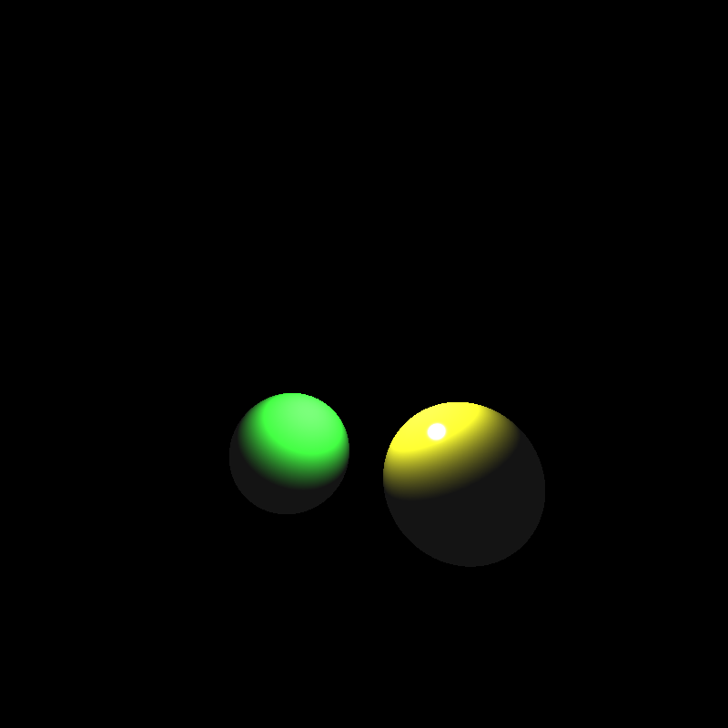 |
|  |  |

I'll investigate this more in the second homework. There's probably an issue with traversal or leaf node intersection tests.

## The Dielectric Struggle

On the last night (October 29th Night), I tried to implement dielectric refraction. Even though I used the exact calculations from the lecture notes, I couldn't make it exactly match the ground truth. I'm not sure what exactly the problem is — could be a sign issue, could be how I'm handling total internal reflection, could be something else entirely. I'll try to fix it in the second homework.

Here's the ground truth and my result:
| Ground truth | Mine |
| --- | --- |
|  | 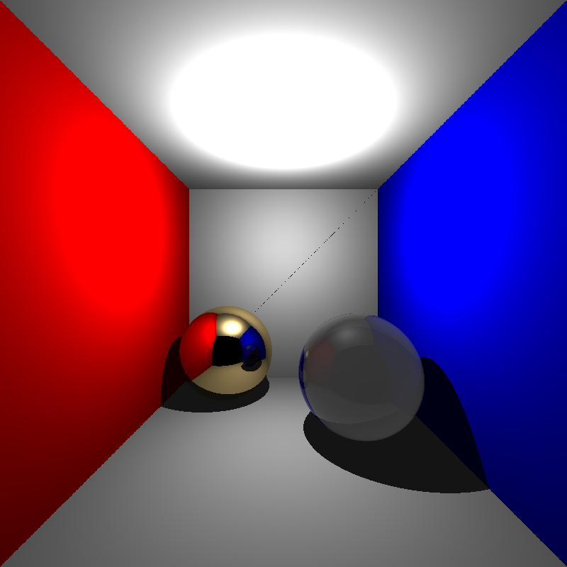 |

## What I Learned

This was a solid learning experience. I'm glad I started with the basics and built up incrementally — it made debugging way easier when things went wrong. The operator overloading saved me tons of code, and splitting things into modular files kept everything manageable.

**What works well:**
- Core intersections (spheres, planes, triangles, meshes)
- Shading (ambient, diffuse, specular with shadows)
- Reflections
- Smooth shading
- Multi-threading
- PLY file parsing
- Different camera types

**What needs work:**
- Dielectric refraction (close but not exact)
- BVH correctness (works for some scenes, broken for others)

Overall, I'm pretty happy with where HW1 landed. I'll iron out the dielectric and BVH quirks in HW2 and push the renderer further. The foundation is solid, which makes adding new features way easier.

## Benchmark and Results Gallery

Since my BVH is buggy, some scenes took forever so I wasn't able to render them.

Scene Name | Pre-process | Render | Total | BVH | Multi-Thread | BFC | Final Image
| --- | --- | --- | --- | --- | --- | --- | --- |
|**Normal Scenes**|
| `bunny.json` | 18 ms | 34 ms | 52 ms | ✅ | ✅ | ✅ |  |
| `bunny_with_plane.json` | 19 ms | 221 ms | 240 ms | ✅ | ✅ | ✅ |  |
| `cornellbox.json` | 0 ms | 99 ms | 99 ms | ❌ | ✅ | ✅ | 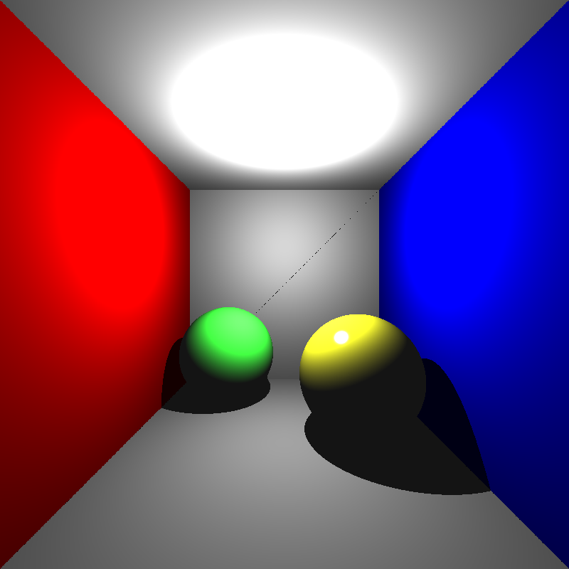 |
| `cornellbox_recursive.json` | 0 ms | 116 ms | 116 ms | ❌ | ✅ | ✅ |  |
| `scienceTree_glass.json` | 0 ms | 57396 ms | 57396 ms | ❌ | ✅ | ✅ | 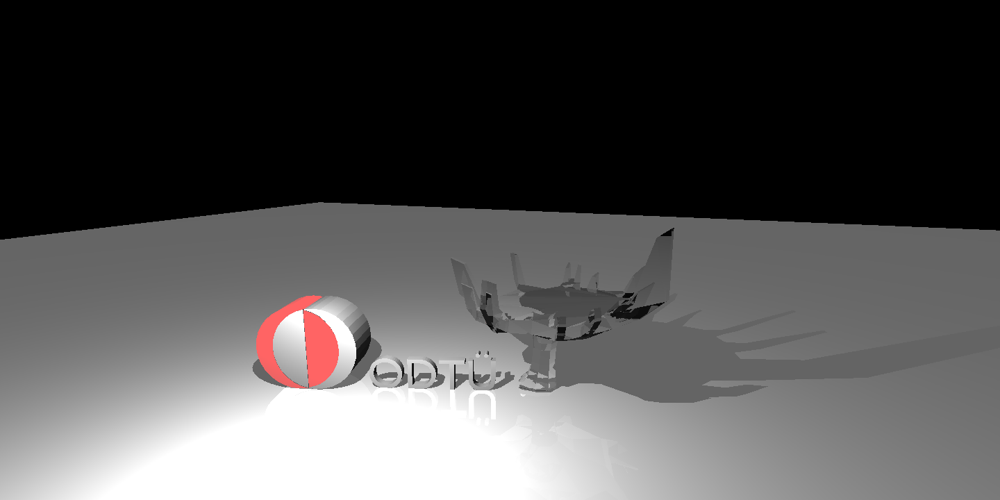 |
| `scienceTree.json` | 0 ms | 31873 ms | 31873 ms | ❌ | ✅ | ✅ |  |
| `simple.json` | 0 ms | 48 ms | 48 ms | ❌ | ✅ | ✅ |  |
| `spheres_mirror.json` | 0 ms | 118 ms | 118 ms | ❌ | ✅ | ✅ |  |
| `spheres_with_plane.json` | 0 ms | 51 ms | 51 ms | ❌ | ✅ | ✅ |  |
| `spheres.json` | 0 ms | 68 ms | 68 ms | ❌ | ✅ | ✅ |  |
| `two_spheres.json` | 0 ms | 20 ms | 20 ms | ❌ | ✅ | ✅ | 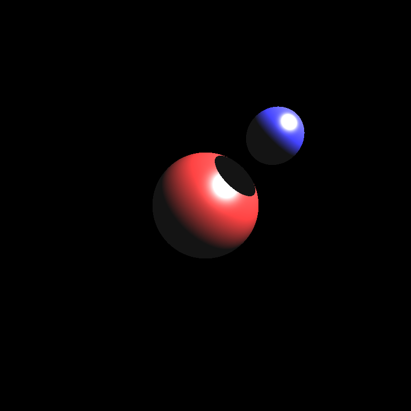 |
|**Raven Scenes**|
| `rt_david.json` | 550 ms | 266 ms | 816 ms | ✅ | ✅ | ✅ | 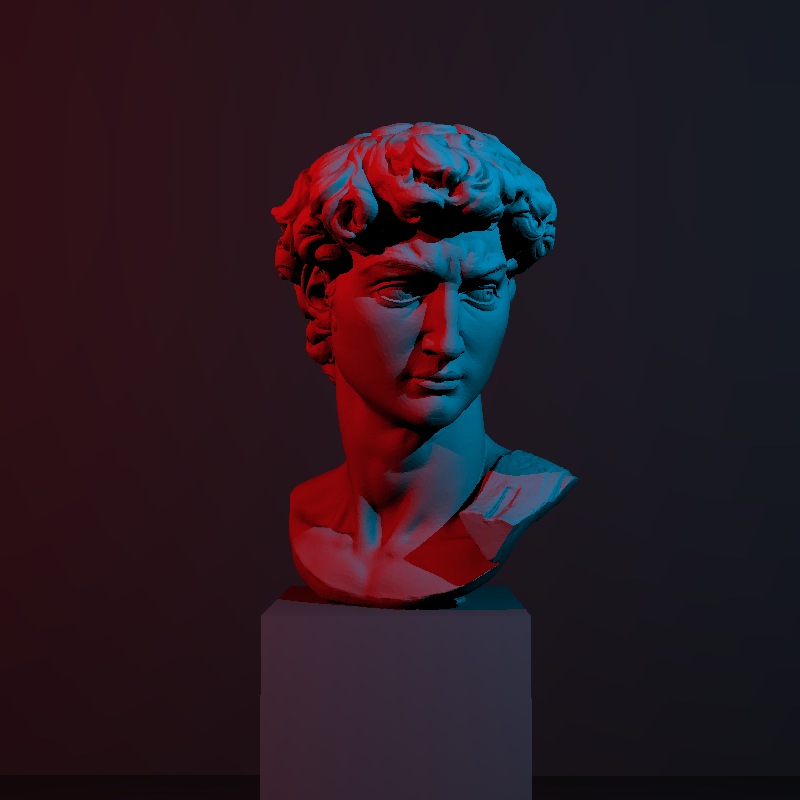 |
| `rt_raven.json` | 0 ms | 43795 ms | 43795 ms | ❌ | ✅ | ✅ | 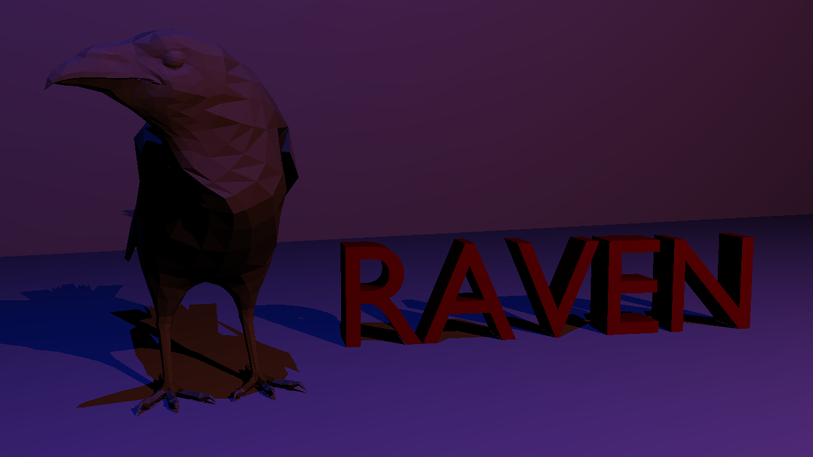 |
| `rt_utahteapot_mug_ceng.json` | 155 ms | 247 ms | 402 ms | ✅ | ✅ | ✅ | 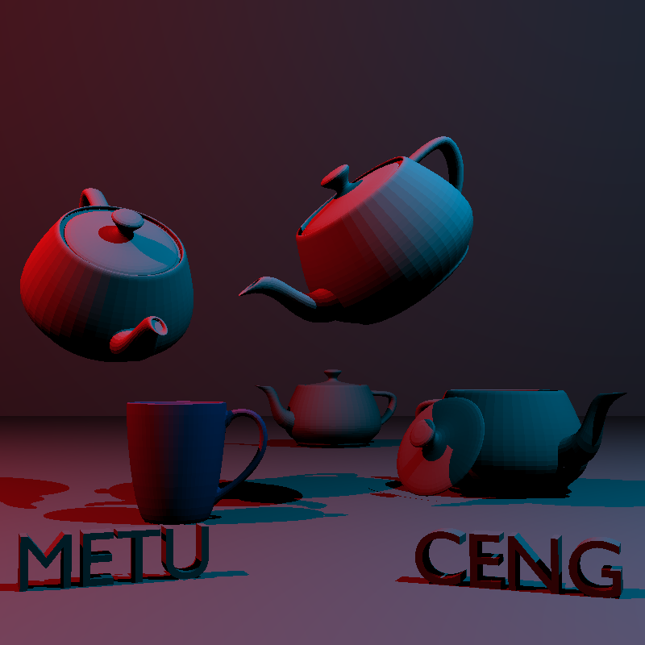 |
|**Akif Uslu Scenes**|
| `berserker_smooth.json` | 9 ms | 189 ms | 198 ms | ✅ | ✅ | ✅ |  |
| `Car_smooth.json` | 0 ms | 95361 ms | 95361 ms | ❌ | ✅ | ✅ | 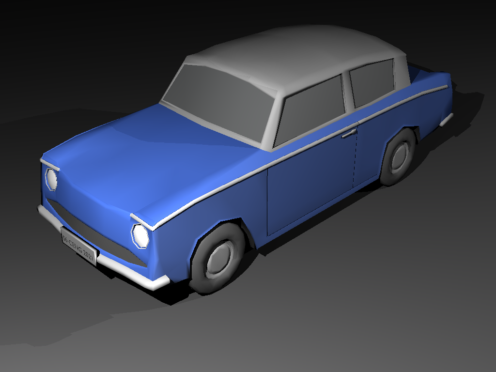 |
| `Car_front_smooth.json` | 0 ms | 95647 ms | 95647 ms | ❌ | ✅ | ✅ | 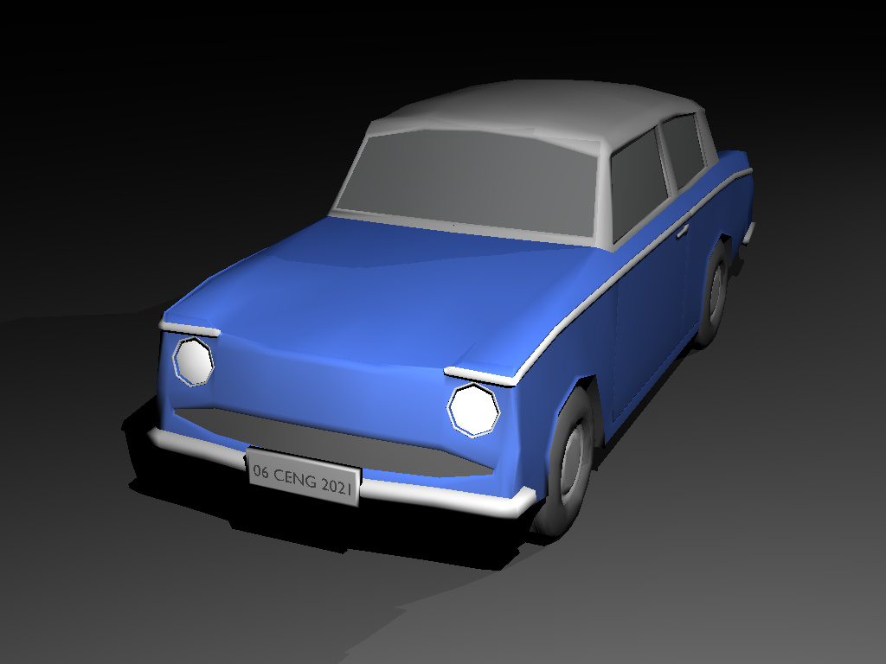 |
| `windmill_smooth.json` | 0 ms | 127802 ms | 127802 ms | ❌ | ✅ | ✅ |  |
