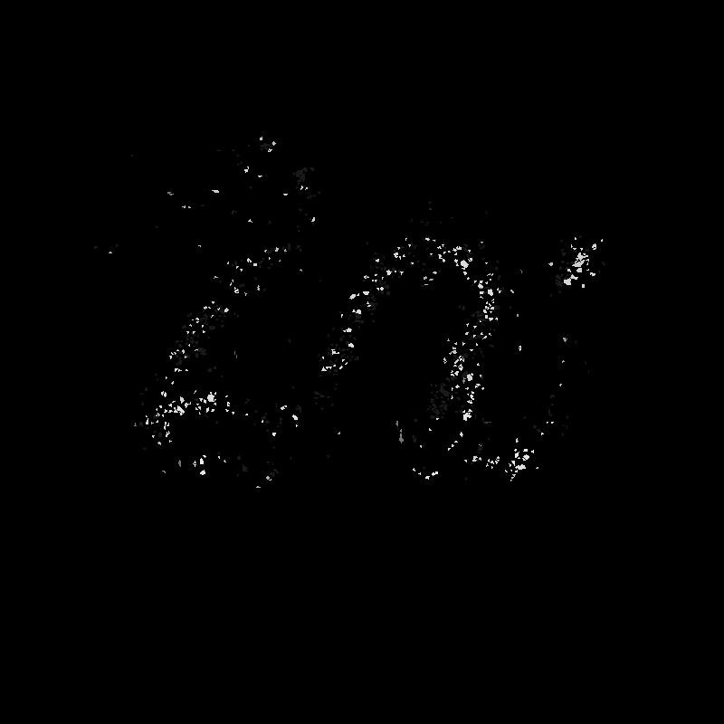
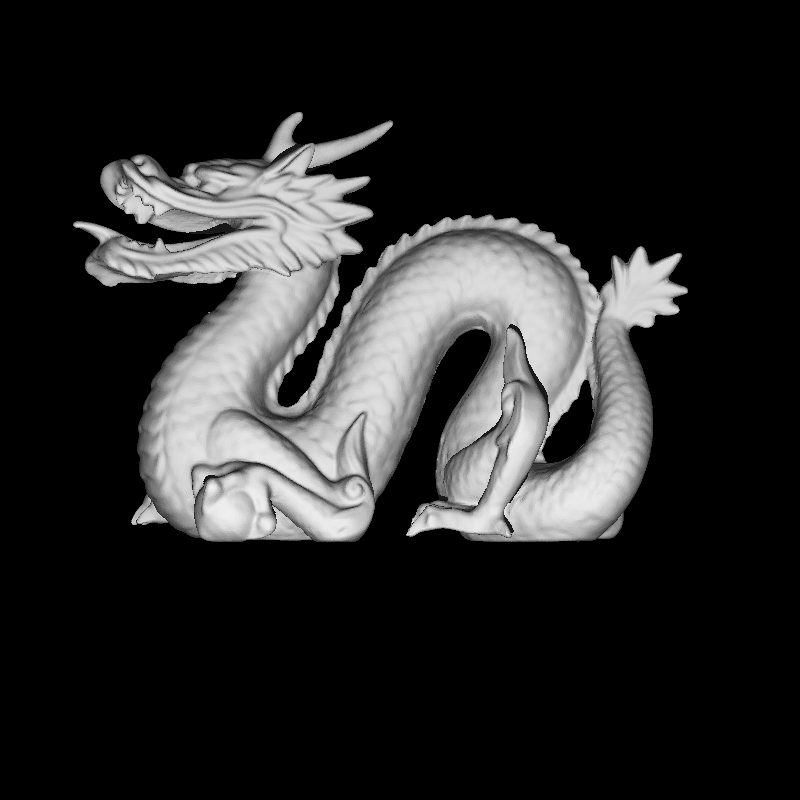
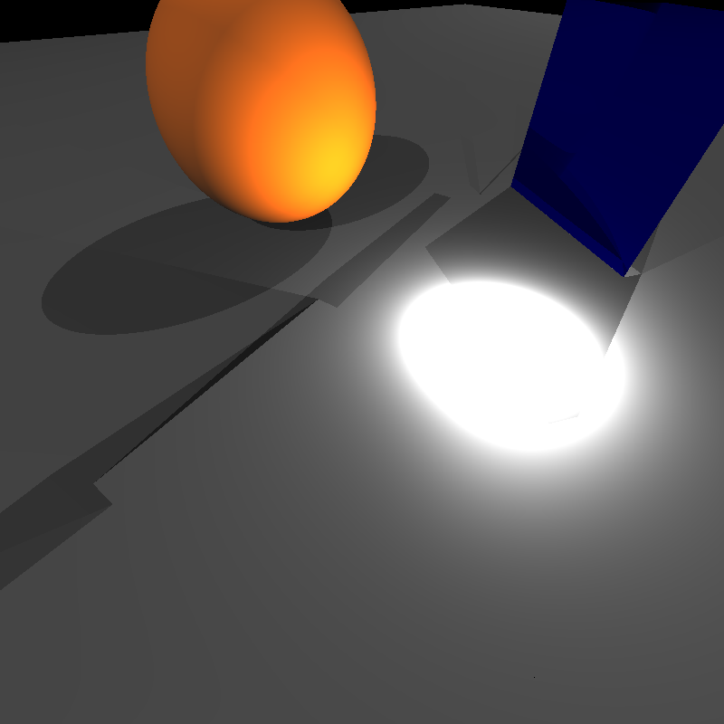
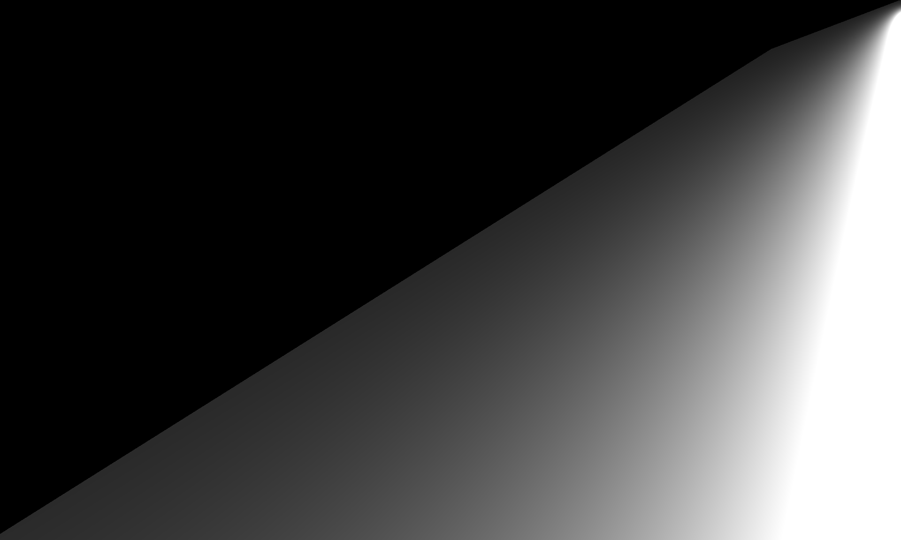
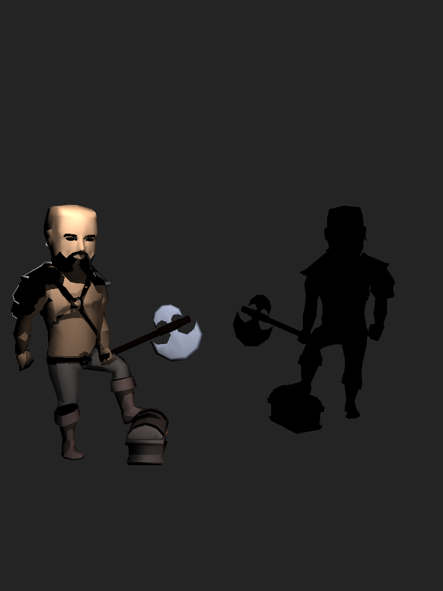
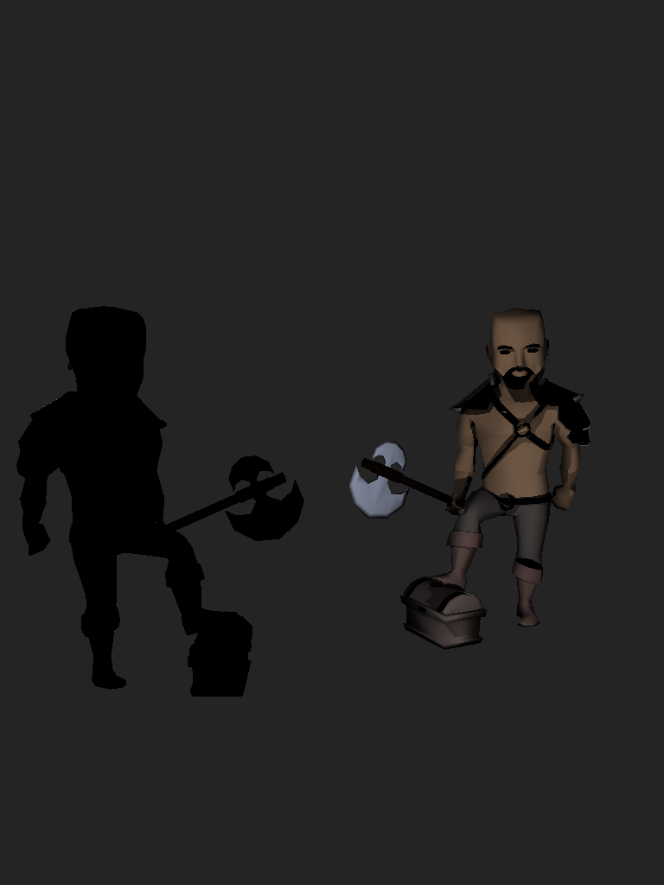
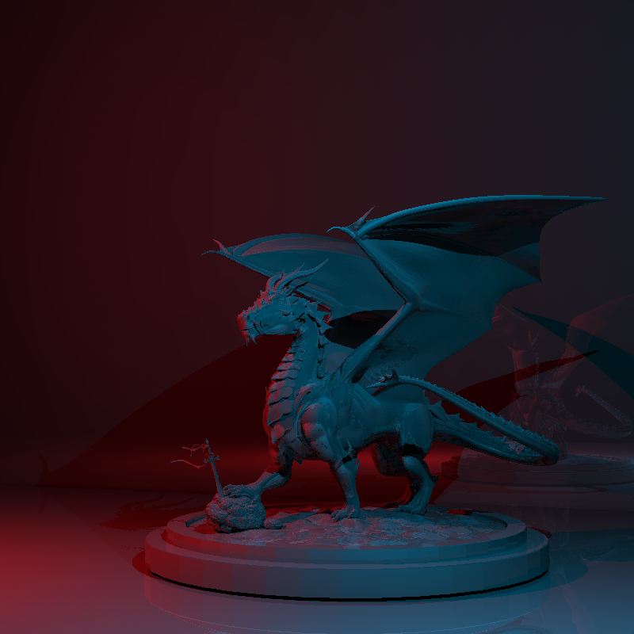
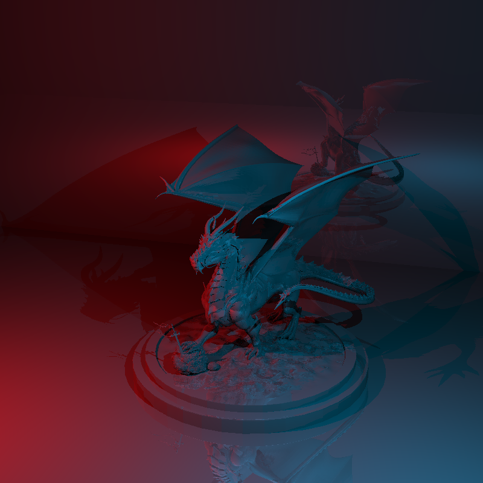
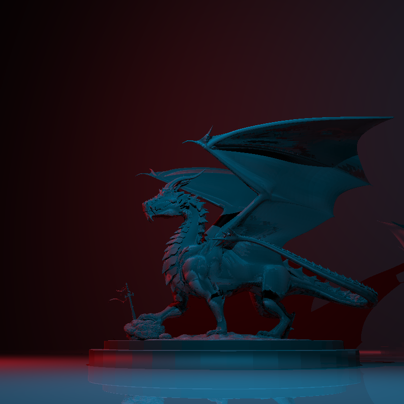

# My Raytracer Journey – Fall 2025 CENG 795 HW2 Blog

> **Murat Bayraktar – 2448199**

This is the continuation of my HW1 raytracer adventure. HW1 ended with a buggy BVH, incorrect dielectric behavior, a couple of camera problems, and a promise that I’d “fix it in the next homework.”  
HW2 was supposed to be all about transformations and instancing, but instead it began by forcing me to fix everything I broke in HW1 before I could even think about moving vertices around.  

This blog is a cleaned-up version of `DIARY2.md`, just like I did with BLOG1. Same structure, same vibe — only more chaos this time.

---

# TL;DR

### What I fixed
- BVH (balanced, correct, no more disappearing meshes)
- Dielectrics (refraction finally looks like refraction)
- Ambient missing in dielectric/conductor paths
- LookAt camera FOV bug (degrees - radians… yes I forgot)
- Material parsing for MeshInstances
- Massive performance bug where I was copying 1.8M faces per ray
- Determinants + precomputation order
- Negative scale reflections (Berserkers…)

### What I implemented
- Full transformation pipeline
- Instancing (with correct world-space bounds)
- Correct triangle winding under negative scale
- Working animated cameras and lights
- Benchmark + metadata + runner scripts

### What still bugs me
- The Berserker still has weirdly dark patches

---

# Fixing BVH (Again): The Real Start of HW2

The homework technically started when transformations were announced, but for me it started when I opened `DIARY2.md` and wrote:  
“It’s been a while since the assignment has been announced… I have two bugs before starting the actual homework.”  

The worst one was BVH.  
In HW1, BVH was “working” — which really meant “working for bunny.json.”  
Everything else either exploded or rendered as dust.

Here's the Chinese dragon before the fix:

| Before (Tiny triangles + too large epsilon = glitter dragon) | After (Fixed) |
| --- | --- |
|  |  |

After digging through determinants on paper, I realized my epsilon (`1e-6`) was too large for scenes with microscopic faces. That alone explained why some meshes disappeared outright.

The second issue was an unbalanced split axis logic. Sometimes the tree became horribly skewed. And finally, I was using `std::vector<int>` as a stack inside traversal, which was a terrible idea. Replacing it with a fixed-size `int stack[64]` removed allocations and sped traversal up dramatically.

After all that, BVH suddenly felt… fast. Actually fast.

---

# Dielectrics: The Ghosts of HW1 Came Back

Dielectrics were wrong in HW1 and, naturally, they were still wrong here.  
In `mirror_room` I finally realized what the issue was:  
my culling and refraction logic disagreed with each other.

A ray entering glass should not be culled based on the same rule as rays hitting from outside. Because of this, interior intersections were computed incorrectly, producing dark reflections.

| Before (Glass plates - no glass at all) | Before (Dark reflections - something deeply wrong) | After (Fixed) |
| --- | --- | --- |
|  |  |  |

I also discovered that ambient wasn't even added for dielectric materials — the return statement literally happened before ambient was added. After fixing culling and ambient placement, the dielectric scenes finally looked normal.

---

# Transformations: Where Everything Broke Again

After BVH and dielectric fixes, I finally started the actual HW2 topic: transformations.

The parsing was easy.  
The math was straightforward.  
The performance? A complete disaster.

Ray–mesh intersection suddenly went from milliseconds to **minutes**, even for simple scenes.  
So I dropped a profiler into the code and got this gem:

```
Instances: 102465 ms
Meshes: 123 ms
Triangles: 0.56 ms
```

Instances alone took **102 seconds**.

Then it hit me:  
I was **copying a vector of ~1.8 million faces for every ray** that passed the world-space bounds test.  
This was the most expensive line of code I’ve ever written without realizing it.

Fixing this turned instancing from “eternal suffering” to “actually usable.”. 

Thankfully I implemented a profiling, it outputs something like this:

```
=== Performance Stats ===
Intersect calls: 695184
BVH traversals: 65536
Triangle tests: 775184
Transformed mesh calls: 695184
World bounds rejects: 629648
World bounds accepts: 65536
Ray transforms: 65536
World bounds reject rate: 90.5727%

=== Timing Breakdown (ms) ===
Time in intersect(): 99.074 ms
Time in rayHitsMesh(): 462.72 ms
  - BVH traverse: 34.1818 ms
  - Ray transform: 12.4943 ms
  - AABB tests: 18.4531 ms
  - Triangle tests: 0 ms
  - Back transform: 1.77951 ms
=========================
```

I also found a hilarious camera bug:  
I forgot to convert FovY from degrees to radians.  
This made the camera look like it was positioned in another universe.

| Before (Filming from a blimp - FOV bug) | After (Fixed) |
| --- | --- |
|  |  |

---

# Precomputation and Transformation Ordering

Another issue came from when I computed triangle determinants.  
In HW1 I precomputed them once.  
In HW2, transformed meshes need recomputation because the triangles move.

At first I used old world-space determinants with transformed geometry.  
That obviously didn’t work.

The correct order was:
1. Parse transformations  
2. Compute transformed world-space bounds  
3. Build BVH on transformed mesh  
4. Precompute determinants *after transformation*

Once I did that, marching dragons finally started looking like dragons instead of a pile of scrambled triangles.

| Before (They were marching somewhere, but not on screen) | After (Finally working) |
| --- | --- |
|  |  |

---

# Negative Scale and the Berserker Incident

The Berserker models exposed a new issue I hadn’t expected: negative scale reflections.  
One of them has:

```
s2 = "0.75 -0.75 0.75"
```

Negative scale flips triangle winding, which flips normals.  
Half the Berserker rendered like a hole.

| Before (Flip test 1) | Before (Flip test 2) | After (Fixed... ish) |
| --- | --- | --- |
|  |   |  |

---

# Material Parsing Chaos

MeshInstances have no material field in JSON.  
My parser failed because it always expected one.  
This caused weird shading defaults and straight up crashes.

It also made the glass plates scene render like this:

| Before (There was supposed to be glass here…) | After (This is what it should look like) |
| --- | --- |
|  |  |

---

# Animations, Scripts, and Final Outputs

After stabilizing the renderer, I wrote two helpers:

- `benchmark.py` – reads metadata.json and generates CSV
- `runner.py` – turns rendered frames into videos

My C++ code writes a metadata JSON per camera, making benchmarking automatic.

### Camera around David  


### Light animation  


### Windmill  


---

# Results Gallery


---

# Benchmark and Results Table

| Scene | Pre-process (ms) | Render (ms) | Total (ms) | BVH | Multi-Thread | BFC | Final Image |
| --- | --- | --- | --- | --- | --- | --- | --- |
| grass_desert | 1 | 15207 | 15208 | ✅ | ✅ | ❌ |  |
| dragon_metal | 615 | 2208 | 2823 | ✅ | ✅ | ❌ |  |
| dragon_new | 117 | 1275 | 1392 | ✅ | ✅ | ❌ |  |
| dragon_new_top | 118 | 1245 | 1363 | ✅ | ✅ | ❌ |  |
| marching_dragons | 296 | 993 | 1289 | ✅ | ✅ | ❌ |  |
| mirror_room | 0 | 1114 | 1114 | ✅ | ✅ | ❌ |  |
| dragon_new_right | 118 | 816 | 934 | ✅ | ✅ | ❌ |  |
| metal_glass_plates | 0 | 861 | 861 | ✅ | ✅ | ❌ |  |
| windmill (360 frames) | 1.95 | 525.91 | 527.86 | ✅ | ✅ | ❌ |  |
| glaring_davids | 25 | 334 | 359 | ✅ | ✅ | ❌ |  |
| davids (360 frames) | 25.85 | 289.64 | 315.49 | ✅ | ✅ | ❌ |  |
| davids_camera (360 frames) | 26.21 | 263.19 | 289.40 | ✅ | ✅ | ❌ |  |
| davids_camera_zoom (360 frames) | 26.17 | 254.80 | 280.98 | ✅ | ✅ | ❌ |  |
| two_berserkers | 1 | 251 | 252 | ✅ | ✅ | ❌ |  |
| ellipsoids | 0 | 86 | 86 | ✅ | ✅ | ❌ |  |
| spheres | 0 | 70 | 70 | ✅ | ✅ | ❌ |  |
| simple_transform | 0 | 46 | 46 | ✅ | ✅ | ❌ |  |


# What I Learned

HW2 was less about adding new features and more about discovering how many corner cases I had ignored in HW1. Transformations exposed BVH bugs. BVH bugs exposed determinant bugs. Determinants exposed camera bugs. Camera bugs exposed material parsing bugs. It was debugging all the way down.

But by the end of it, the renderer felt solid. I can now feed it large meshes, instanced objects, camera paths, and videos without the renderer crying.

And the debugging journey was surprisingly fun.