# My Raytracer Journey – Fall 2025 CENG 795 HW3 Blog  
> **Murat Bayraktar – 2448199**

This is HW3 — the assignment that started as “just add sampling and motion blur” and ended with me rewriting half the intersection pipeline, fixing concave geometry, debugging water inside a tap for days, and building a progressive GUI window *so I could watch pixels suffer in real-time.*

This blog follows the same structure as my previous ones: a cleaned-up version of my diary, the bugs, the fixes, the chaos, the screenshots, and—finally—the benchmark.


# TL;DR

### What I implemented
- Jittered multi-sampling  
- Aperture & Depth of Field  
- Area lights (square lights with proper integration)  
- Motion blur (time-dependent transforms with object-local correction)  
- Roughness-based stochastic reflections/refractions  
- Full per-ray image-plane clipping  
- Proper intersection ordering for concave & layered geometry  
- Iterative progressive renderer + GUI visualizer  
- Precomputed sample buffers (jitter + time + noise dims)

### What I fixed
- Green glass bug  
- Near-distance clipping explosion  
- Area light ceiling-darkness mystery  
- Mesh scaling rejection bug  
- “Tap + water” concave ordering madness  
- Wrong subpixel sampling (accidentally raytraced with nonsense offsets at first)  
- Motion-blur inconsistent time propagation  
- Secondary rays losing their sample time  
- AABB vs. motion blur disagreement

### What still bugs me
- Why every bug somehow traces back to normals  
- Why concave geometry always brings pain  
- Why the tap water haunts me at night

# Multi-Sampling: The Beginning of HW3

I started HW3 with jittered sampling — expecting it to be trivial.  
It wasn’t.

The logic was correct on paper:

```cpp
ξ1 = random(0,1)
ξ2 = random(0,1)
sx = (x + ξ1) / nCols
sy = (y + ξ2) / nRows
```

Except I… only passed the jitter *itself* into the ray generator instead of adding it to (x, y).  

*So the first version of my “multi-sampled” renderer looked like someone smeared Vaseline on the Cornell box. (I saw this joke on the internet lol)*


After fixing this, everything instantly improved, and performance dropped as expected. 

>At least this time I didn’t try to optimize before things worked.

# Aperture & Depth of Field

DOF turned out to be only ~6 lines of code:

- Sample a point on the lens  
- Offset the camera origin  
- Recompute ray direction toward the focus plane

The square aperture was a blessing — sampling a disk would’ve been more math at 2AM.

Later in my journey I also noticed while playing with the chess pieces scene that there are mirror reflections but the scene wasn't showing any mirrory look. I haven't noticed this because I was doing reflections only when type is mirror. However, this time I tried enabling when non-zero and results looked good. But after I post to the forum I found out I should have kept it that way.

My favorite output, the glass queen scene:
| Mirrorish | Depth-of-Field |
| --- | --- |
| 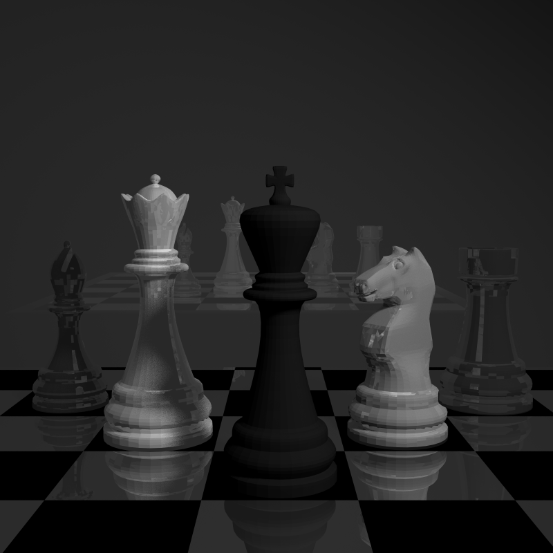 |  |


# Area Lights: The Ceiling Problem

At first, my area lights technically worked.. but they didn’t illuminate the ceiling at all.

I was sampling the area incorrectly relative to the light's normal, effectively treating the light as a directional emitter instead of a two-sided square.

After correcting the sampling domain + radiance distribution, the Cornell box finally lit up properly. **Although it's not exactly the same as ground-truth but okay...**

| How Ceiling Looked | After I fixed (n't) |
| --- | --- |
| 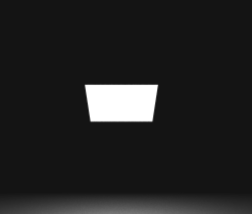 | 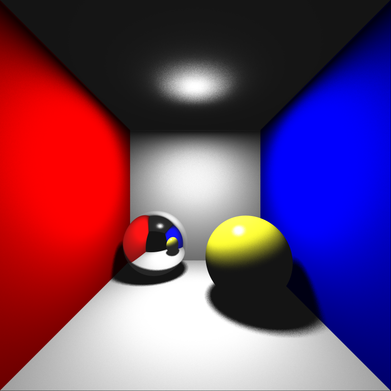 |


# Roughness: Stochastic Reflections That Look Alive

Roughness = sample around the perfect reflection/refraction direction with a cone whose size = roughness.

It sounds simple until you try it inside a dielectric and accidentally generate directions *inside* the normal.

Once the normal-flipping logic was fixed (more on that below), roughness started behaving beautifully:
| Before | After |
| --- | --- |
| 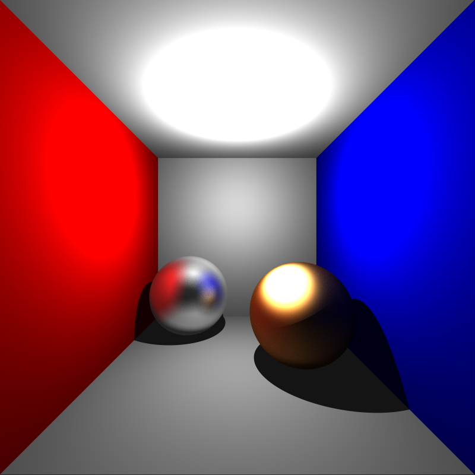 |  |


# Scaling Bug

Today I tracked down why scaled meshes were “disappearing” from the render while still casting shadows.
Root cause: for transformed meshes I was using the global world-space t_min as the intersection cutoff in object space. When the mesh was scaled (especially down), the object-space hit distance became larger than world t_min, so all primary ray hits were rejected.

Fix: for transformed meshes I introduced a separate local t_min in object space (initialized to inf) and kept the incoming t_min only as original_t_min in world space. After intersecting in object space and back-transforming the hit point, I compare the resulting worldDistance with original_t_min and update the global t_min only if this hit is closer. This decouples object-space intersection distances from world-space pruning and prevents scaled meshes from disappearing.

| Initial Scene | Scaled Less | After Fix
| --- | --- | --- |
| 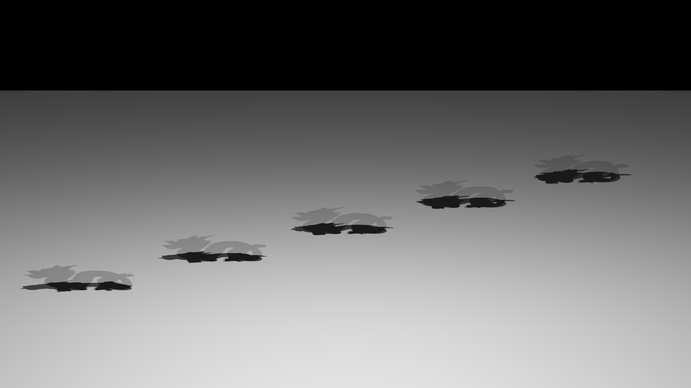 | 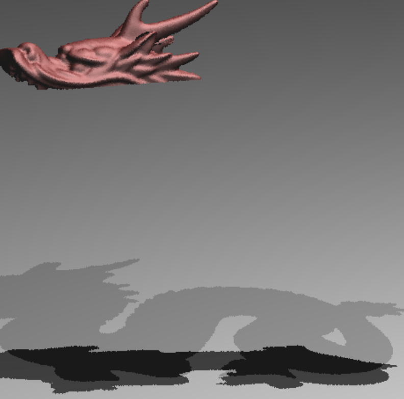 |  |

---

# Image-Plane Clipping: The Near-Distance Explosion

This was a *mess*.

I noticed this when I was trying to render the dynamic cornell box. In Dynamic cornell box the there was a mirror in between the camera and the image plane. The image plane was at 10.08 and the mirror was at 10. Therefore it occluded everything.

My first fix was naïve:  
use nearDistance as a 3D radial cutoff.

This created an expanding circular void in front of the camera. I tried to show by zooming the camera so the effect is much more vivid. Since I used constant nearDistance check it was only working for the rays in the middlea (near-perpendicular ones) as you go to the edges the distance increases which I forgot initially. Look below gradual expansion to understand the issue.

| Zoom 1 | Zoom 2 | Zoom 3
| --- | --- | --- |
| 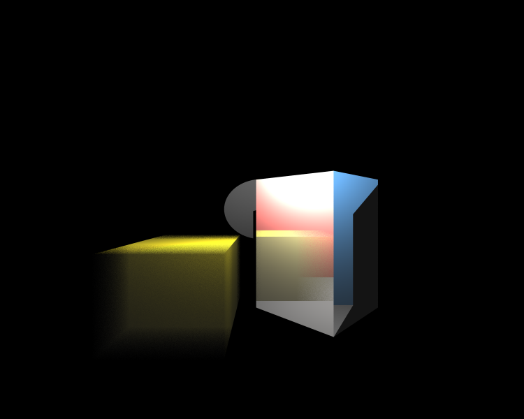 | 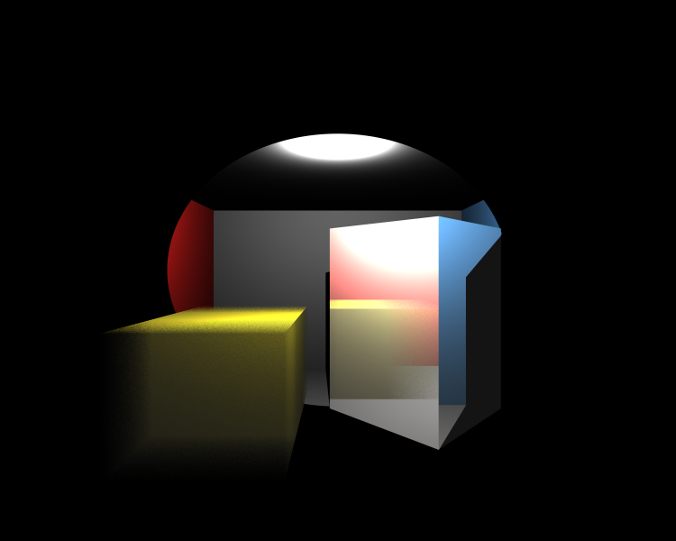 | 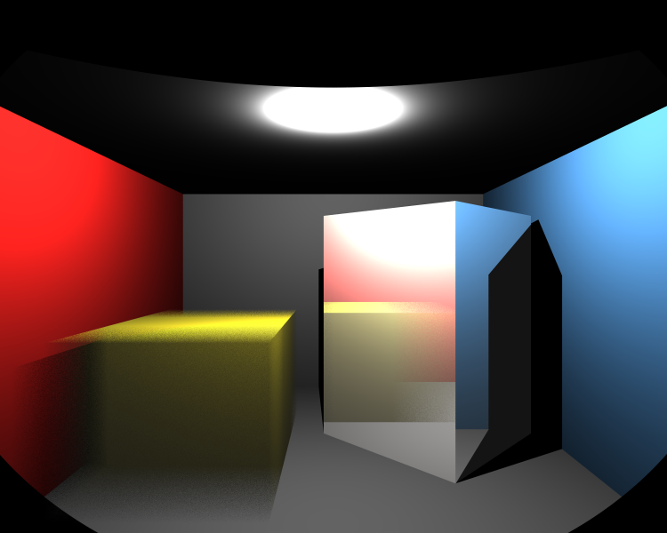 |

The proper fix:

Compute for each ray where it intersects the camera’s image plane.  
Set **that** as the minimum distance for intersections.

This cleaned up every camera-dependent bug in the project.

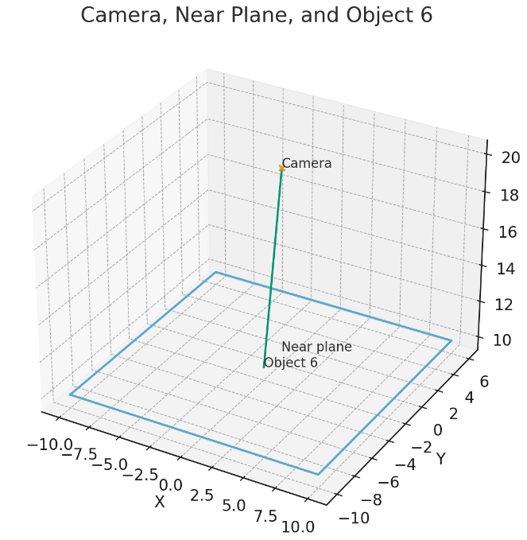

---

# The Tap + Water Incident (A.K.A. “The Boss Fight”)

This was the final boss of HW3.

In the “tap with water inside” scene, water rendered **in front** of metal.  
At first I blamed:

- Smoothing  
- Normals  
- Transform order  
- Motion blur  
- Concavity  
- Mesh order  
- My GPU  
- Myself  

Turned out the real villain was:  
**mixing object-space t with world-space t_min**.

A ray hitting:

tap outer --> water outer --> water inner --> tap inner --> exit

was comparing those hits in different coordinate systems. Sometimes the inner surface won because its *local* t looked smaller.

I am not sure but also it might have something to do with object being concave. Fixing the logic might also have fixed that check either.

After this, the scene finally behaved:

| Before | After |
| --- | --- |
| 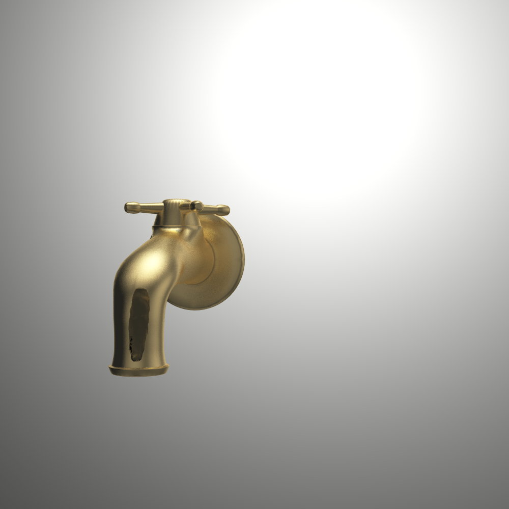 | 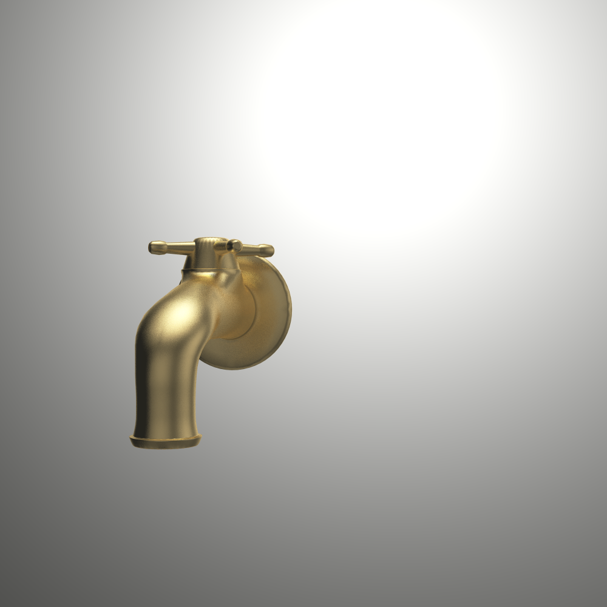 |

---

# Progressive Renderer + GUI

I added a fully progressive rendering mode:

- Precompute samples (jitter + time + noise)
- For sample k:
  - Render every pixel
  - Accumulate into a float buffer
  - Occasionally dump an iterative frame
- GUI window updates as it converges

I can now *watch* the renderer clean up noise:

| Chess | Deadmau5 |
| --- | --- |
|  |  |

This is probably my favorite feature in HW3.


# More Outputs

A selection from final renders:

| Scene | Image |
| --- | --- |
| Deadmau5 |  |
| Wine glass |  |
| Focusing dragons |  |


# Benchmark Results (HW3)

All results are bvh + multi threading.

| Scene | Pre-process (ms) | Render (ms) | Total (ms) | Final Image |
| --- | --- | --- | --- | --- |
| wine_glass | 0 | 1,691,977 | 1,691,977 |  |
| dragon_dynamic | 605 | 215,664 | 216,269 |  |
| chessboard_dof_glass | 9 | 64,921 | 64,930 |  |
| deadmau5 | 2 | 45,811 | 45,813 |  |
| focusing_dragons | 280 | 44,394 | 44,674 |  |
| cornellbox_brushed_metal | 0 | 32,611 | 32,611 |  |
| metal_glass_plates | 0 | 30,605 | 30,605 | 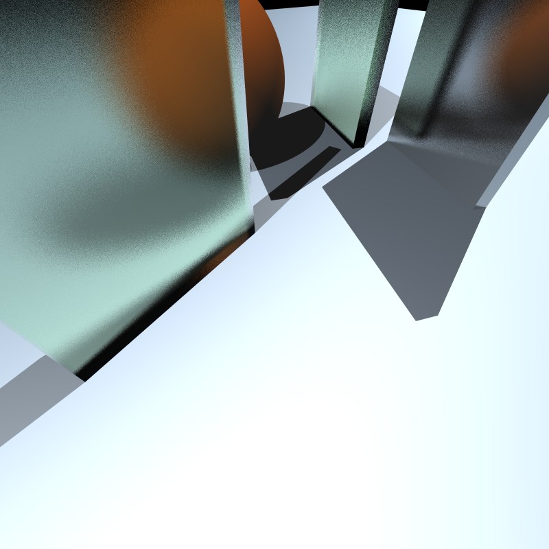 |
| chessboard_arealight_dof | 10 | 23,690 | 23,700 | 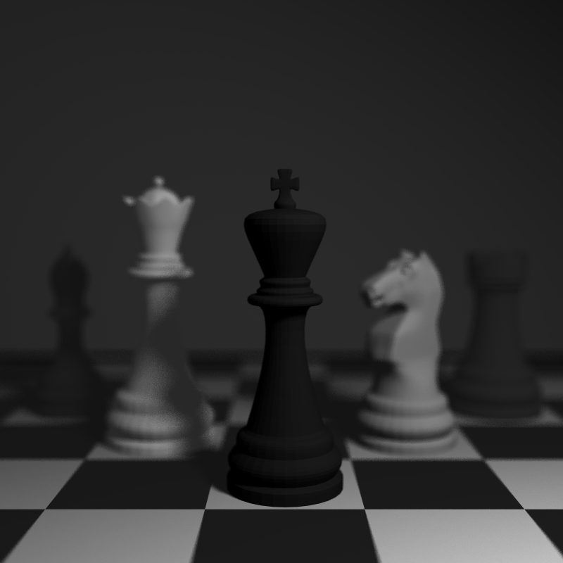 |
| chessboard_arealight | 10 | 21,990 | 22,000 |  |
| tap_0035 | 4 | 14,884 | 14,888 | 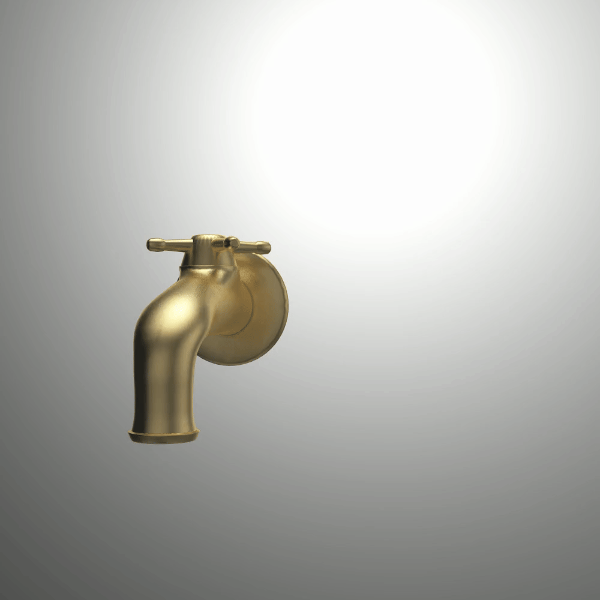 |
| cornellbox_boxes_dynamic | 0 | 9,802 | 9,802 | 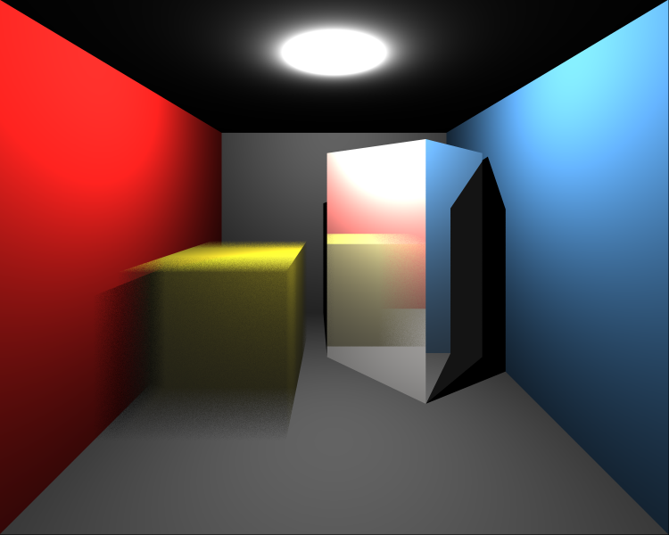 |
| cornellbox_area | 0 | 7,890 | 7,890 |  |
| spheres_dof | 0 | 7,432 | 7,432 | 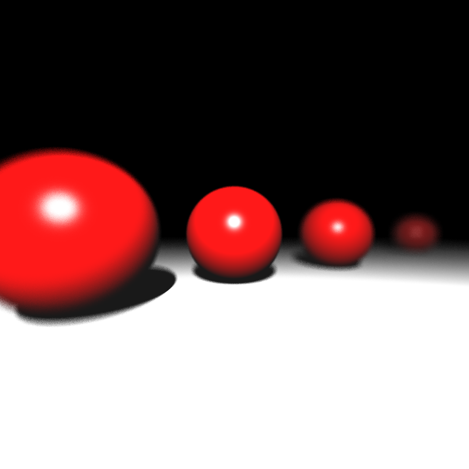 |

---

# What I Learned

HW3 taught me that:

- Sampling multiplies your bugs by the number of samples  
- Motion blur multiplies your bugs by the number of coordinate spaces  
- Concave geometry multiplies your bugs by the number of surfaces  
- Water multiplies your bugs by the number of refractions  
- A single inconsistent t-value can destroy your entire scene  
- Progressive rendering makes debugging much easier  
- Writing a diary genuinely accelerates debugging

But the biggest lesson was this:

##### **Always compare intersections using one consistent world-space distance.**  
Everything else is chaos.

# Final Thoughts

This was the most fun homework of the course so far — but by the end, the renderer feels robust, clean, and capable of producing genuinely beautiful images.

HW4, you may come.  
I’m ready.