# My Raytracer Journey – Fall 2025 CENG 795 HW5 Blog

> **Murat Bayraktar – 2448199**

This is HW5 — the final homework. The one where I thought "HDR and advanced lights, how hard can it be?" and then discovered that HDR means "High Dynamic Range" but also "Here's Debugging Required" because apparently my renderer had been living in a world where colors only existed between 0 and 255, and it was not ready for the real world.

This blog is a cleaned-up version of `DIARY5.md`, following the same structure as my previous ones: the bugs, the fixes, the chaos, the screenshots, and—finally—the benchmark. This is the last one. Let's make it count.

# TL;DR

### What I implemented
- Three new light types (directional, spot, environment lights)
- HDR image loading (EXR and HDR formats)
- HDR image writing
- Three tone mapping operators (Photographic, Filmic, ACES)
- Modified rendering pipeline to use float buffers (goodbye, 255!)

### What I fixed
- Tone mapping log-average luminance (was rendering like the sun exploded)
- Environment light Monte Carlo estimator (π terms canceling incorrectly)
- Latlong environment map UV mapping (horizontally flipped and rotated)
- HDR texture sampling (was returning black because I checked the wrong pointer)
- Normalizer for HDR textures (multiplying by 255 when I shouldn't)

### What I learned
- HDR means your bugs are also high dynamic range
- A single minus sign in `atan2` can rotate your entire environment map
- Checking `image->data` when the data is in `image->hdrData` is a special kind of debugging experience
- Tone mapping is basically "make bright things less bright but still look good"

# The Float Buffer Revolution: Goodbye, 255!

HW5 started with a fundamental shift: moving from `unsigned char*` to `float*` buffers. For four homeworks, my renderer had been living in a world where colors were integers between 0 and 255. Now we're entering the real world where light can be *any* value, and I had to convince my code that this was okay.

The change itself was straightforward — replace `unsigned char* image` with `float* hdrImage` everywhere. But then I realized I had been clamping colors in `__compute` to [0,255] this whole time, which meant my renderer was basically wearing blinders. Removing that clamp felt like taking off sunglasses indoors — suddenly everything was brighter and more detailed.

The tricky part was handling both HDR and LDR outputs. If the filename ends in `.exr` or `.hdr`, save it directly as HDR. If tone mapping is specified, apply it and save PNG. Otherwise, convert to LDR with clamping for backward compatibility. Because apparently we still need to support the old world sometimes.

# Tone Mapping: When Bright Things Are Too Bright

Tone mapping is the art of taking HDR values (which can be 0 to infinity, theoretically) and squishing them into [0,1] for display. I implemented three operators: Photographic (Reinhard), Filmic, and ACES.

The photographic operator was supposed to be straightforward — follow Equations 1-4 from Reinhard's paper. Easy, right?

Wrong.

My first version rendered everything like the sun had exploded. The scene was so bright it hurt to look at. The issue? I was using `key * Yi` directly instead of properly normalizing by the scene's log-average luminance.

According to Reinhard's paper (which I should have read more carefully), you need to:
1. Compute log-average luminance: `Lw = exp(sum(log(δ + Li)) / N)`
2. Scale each pixel by `(key / Lw) * Yi`, not just `key * Yi`

This makes the average luminance of the scene map to the key value (typically 0.18 = middle gray). Without this normalization, the tone mapper was basically doing nothing useful, and my scenes looked like someone had turned the brightness to maximum.

After fixing this, the photographic tone mapping finally produced images that didn't require sunglasses to view.

# Environment Lights: The UV Mapping Nightmare

Environment lights are the most complex of the three new light types. They use an HDR environment map image and sample directions from the upper hemisphere.

The sampling part was fine — either uniform or cosine-weighted hemisphere sampling. The tricky part was converting the sampled direction to UV coordinates for the environment map.

I spent way too long debugging why my environment maps were showing the wrong parts of the scene. The spheres were reflecting things, but they were horizontally flipped and rotated. It looked like the environment map was from a parallel universe.

The correct formula for latlong mapping is:

```cpp
u = 0.5 + std::atan2(direction.x, -direction.z) / (2.0 * M_PI);
v = std::acos(clampedY) / M_PI;
```

Where:
- `atan2(x, -z)` computes azimuth angle (horizontal rotation around Y-axis)
- `acos(y)` computes polar angle from top pole
- The `0.5` offset centers forward direction (-Z) at panorama center

That minus sign in front of `z`. That one minus sign..

After fixing this, both `mirror_sphere_env` and `glass_sphere_env` scenes finally matched the ground truth perfectly. The environment maps were no longer from a parallel universe.


| Before | After |
| --- | --- |
| 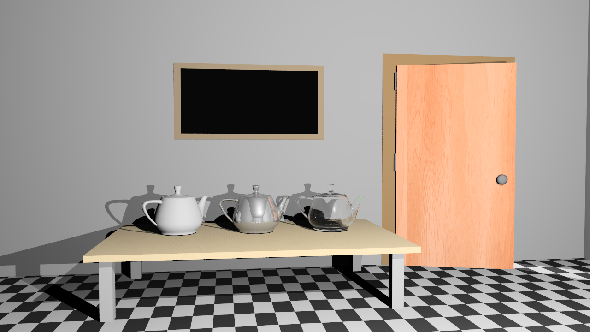 | 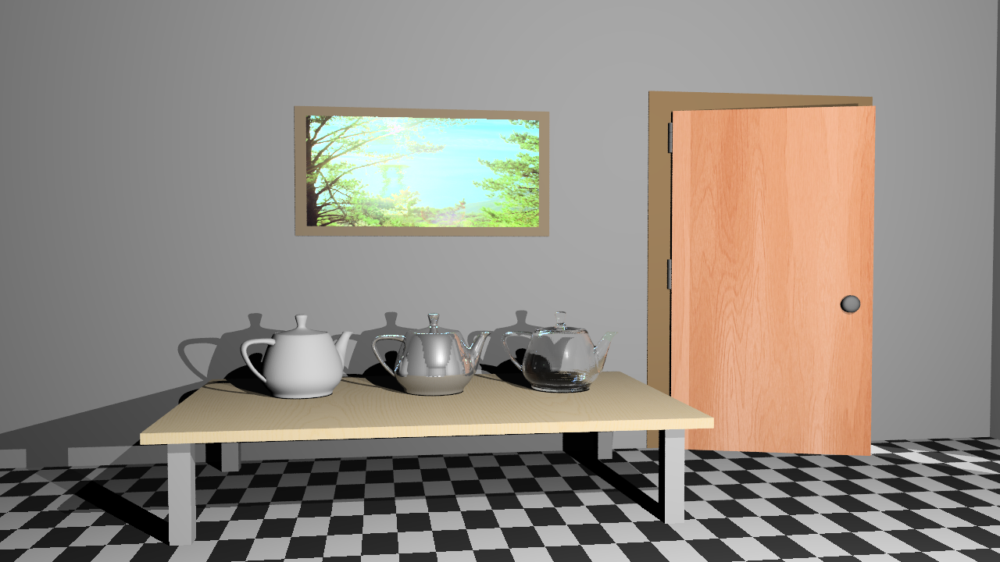 |

# The Black Sphere Mystery

When testing the `sphere_point_hdr_texture` scene, I got a completely black sphere. Not "dark" — completely black. Like someone had painted it with vantablack.

Turns out the texture sampling functions weren't handling HDR images at all. They all had this check:

```cpp
if (!image || !image->data) {
    return VectorFloatTriplet{0.0, 0.0, 0.0};
}
```

For HDR images, the data is stored in `image->hdrData`, not `image->data`, so the check was failing and returning black. Also, the sampling code was trying to access `image->data[idx] / 255.0` which doesn't make sense for HDR — those values are already floats in proper radiance units.

Fixed by checking for both LDR and HDR data:

```cpp
if (!image || (!image->data && !image->hdrData)) {
    return VectorFloatTriplet{0.0, 0.0, 0.0};
}
```

Then branching based on `image->isHDR` — for HDR, use `hdrData` directly (no division by 255), for LDR, use `data` with normalization. Updated all three interpolation functions the same way.

| Before (Black sphere of sadness) | After (Beautiful environment map) |
| --- | --- |
|  | 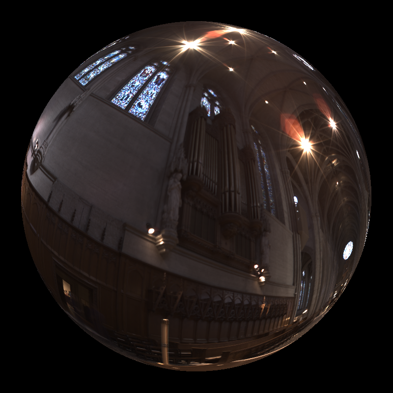 |

There was also a subtle issue with the normalizer correction. It was applying `255.0 / normalizer` to all textures, which makes sense for LDR but HDR values are already in proper radiance units and shouldn't get multiplied by 255. Fixed by checking if the image is HDR before applying the normalizer.

Now `sphere_point_hdr_texture` renders correctly with the grace cathedral environment map showing on the sphere instead of being black!


| Before | After |
| --- | --- |
|  |  |

# Environment Light Monte Carlo: When π Terms Cancel

The environment light formula had wrong scaling. For cosine-weighted sampling with physically correct Lambertian BRDF (ρ/π):
- PDF = cos(θ)/π
- Integrand = L * (ρ/π) * cos(θ)
- Estimator = Integrand/PDF = L * ρ (the π terms cancel!)

So the correct formula is just `envContribution = radiance * diffuseReflectance` — no π multiplier needed.

I had been multiplying by π somewhere, which made the environment lighting way too bright. After fixing this, the environment lights finally looked physically correct.

# Directional and Spot Lights: The Easy Ones

Directional lights are simple — just direction and radiance, no distance attenuation. Check if surface faces the light, shadow test, then add diffuse + specular. Pretty straightforward.

Spot lights are more interesting. Need to calculate the angle between the light direction and the vector to the intersection point. If it's outside the coverage angle, skip. If it's between falloff and coverage, apply the spot attenuation formula:

```cpp
double spotAttenuation = std::pow((cosAlpha - cosCoverage) / (cosFalloff - cosCoverage), 4.0);
```

Then multiply by distance attenuation like point lights. The formula in the spec uses degrees, so I convert to radians. Because apparently we're still living in a world where some people think in degrees.

# Results Gallery

Some of my favorite renders from HW5:

| Scene | Image |
| --- | --- |
| Glass Sphere with Environment | 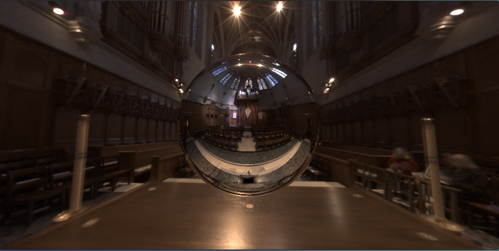 |
| Veach Ajar (ACES) |  |
| Teapot (I reduced the sample rate) | 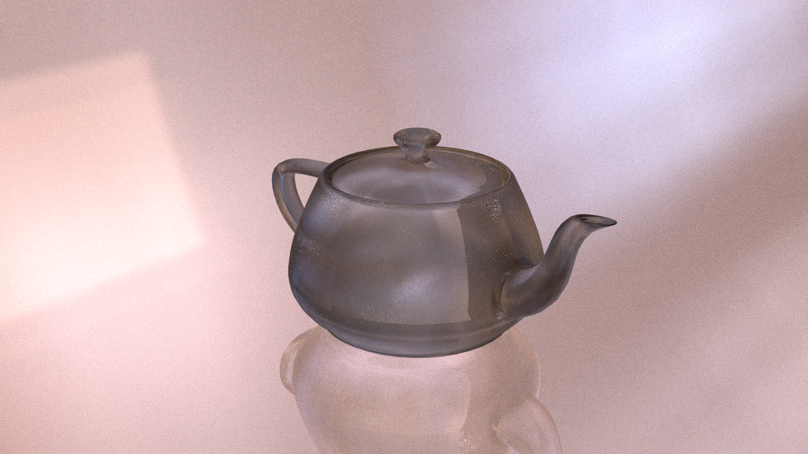 |
| Teapot (I reduced the sample rate) | 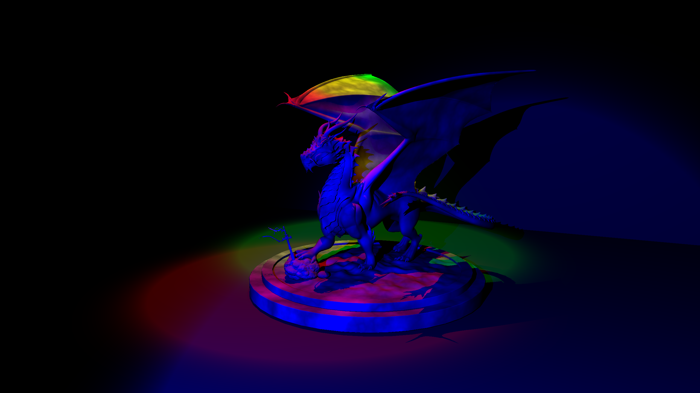 |
# The Faulty vs Fixed Comparison

Let's see how things looked before and after:

| Scene | Faulty | Fixed |
| --- | --- | --- |
| Sphere with HDR Texture |  |  |
| Sphere Environment Light | 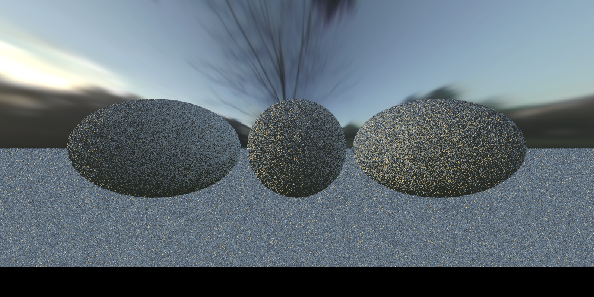 | 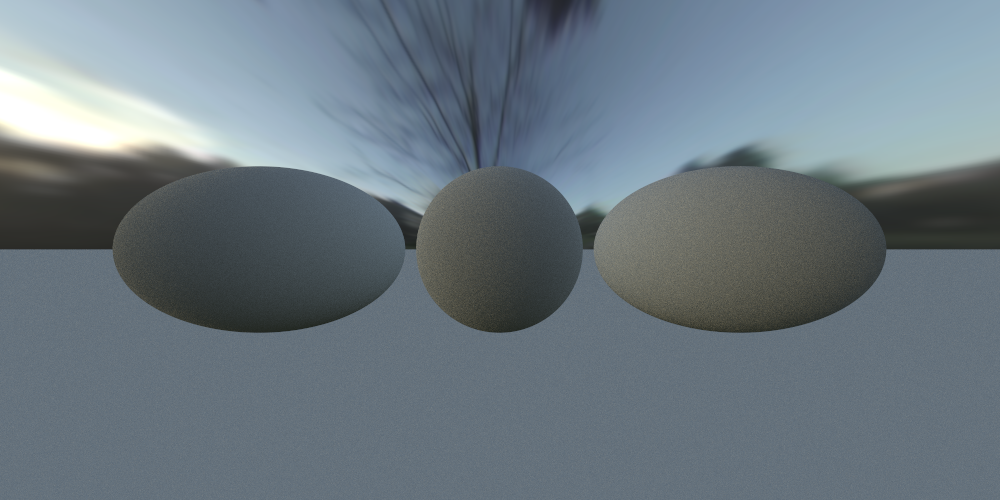 |
| Veach Ajar (ACES) |  |  |
| Cube with Directional Light |  | 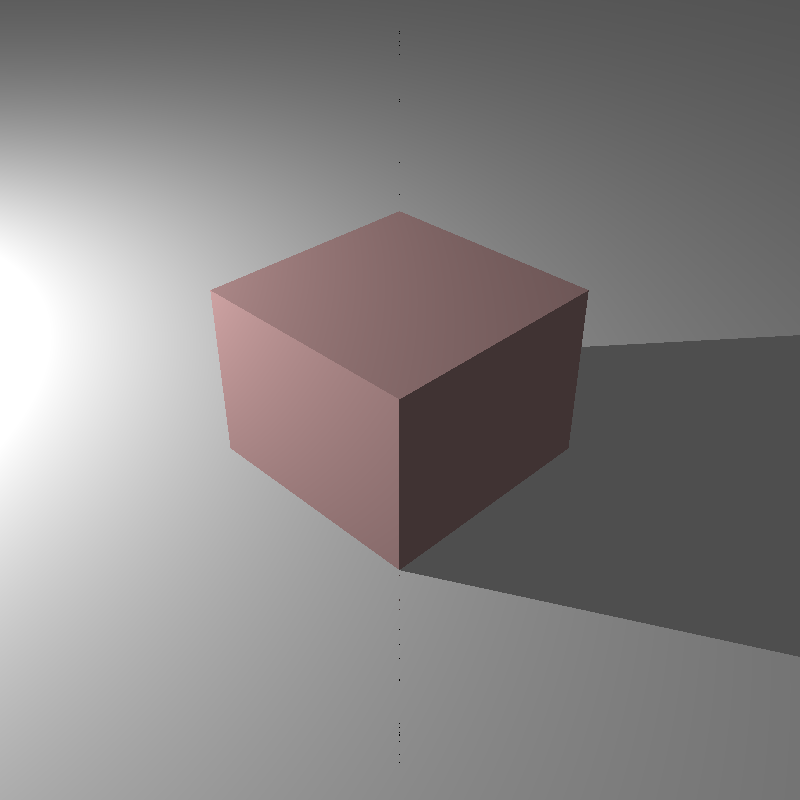 |

The faulty versions show various issues: black textures, wrong environment mapping, incorrect tone mapping. The fixed versions show proper HDR rendering with correct lighting and tone mapping.

# Benchmark Results (HW5)

All results with BVH enabled and multi-threading. HDR rendering is slower than LDR because we're dealing with float buffers and more complex lighting calculations.

| Scene | Pre-process (ms) | Render (ms) | Total (ms) | Final Image |
| --- | --- | --- | --- | --- |
| teapot_roughness_phot | 3 | 100,342 | 101,234 |  |
| glass_sphere_env | 0 | 107,223 | 107,223 | 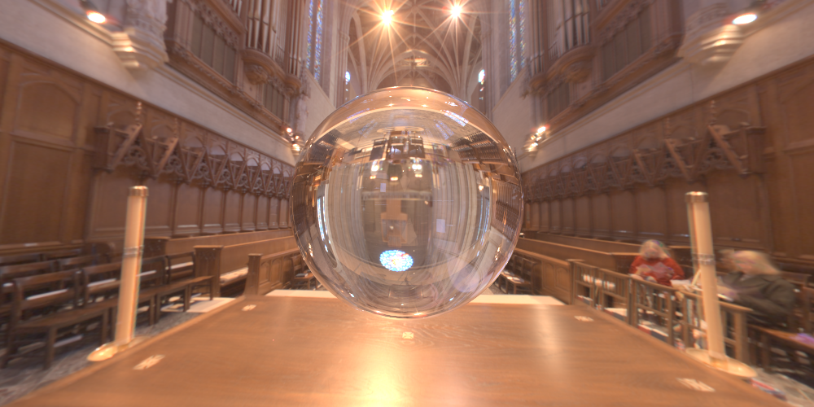 |
| VeachAjar | 39 | 33,097 | 33,136 | 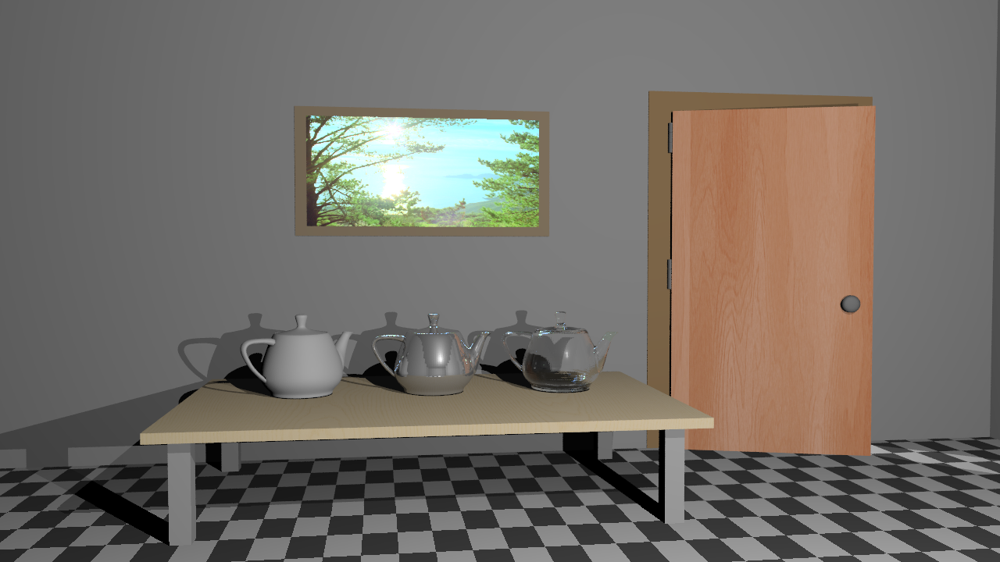 |
| dragon_spot_light_msaa | 319 | 7,828 | 8,147 | 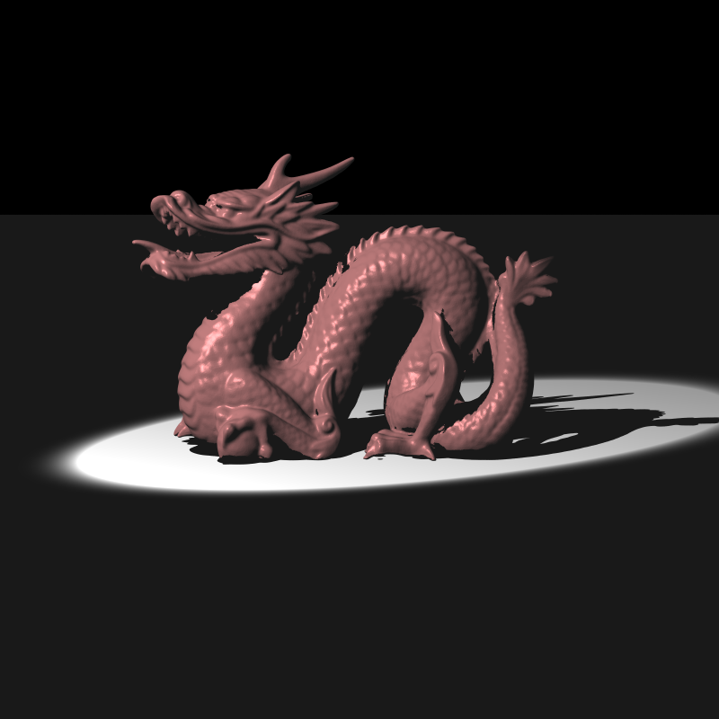 |
| head_env_light | 3 | 6,237 | 6,240 | 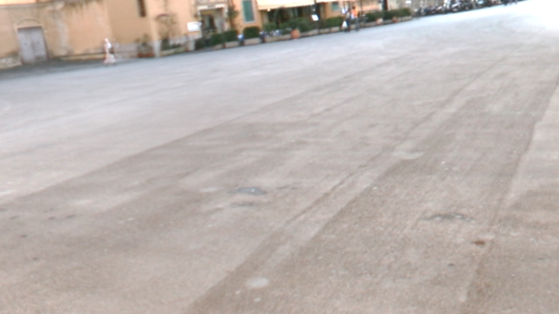 |
| dragon_new_with_spot | 322 | 2,976 | 3,298 |  |
| sphere_env_light | 0 | 440 | 440 |  |
| cube_point_hdr | 0 | 119 | 119 |  |
| cube_point | 0 | 98 | 98 | 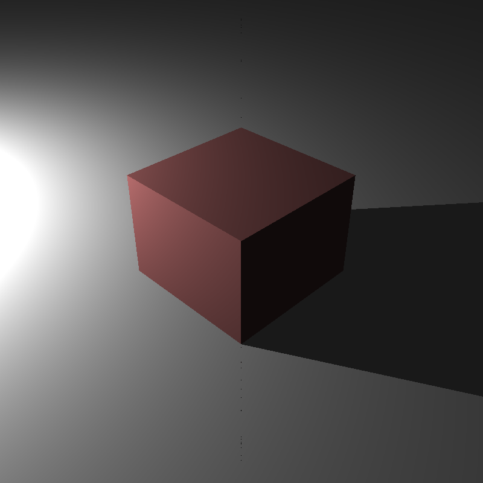 |
| cube_directional | 0 | 76 | 76 |  |
| sphere_point_hdr_texture | 0 | 64 | 64 |  |
| mirror_sphere_env | 0 | 51 | 51 | 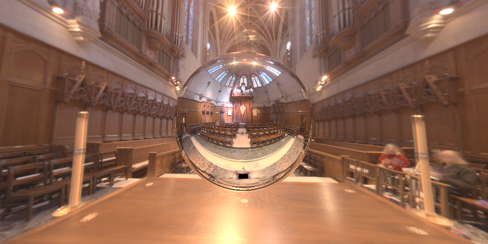 |
| empty_environment_latlong | 0 | 21 | 21 | 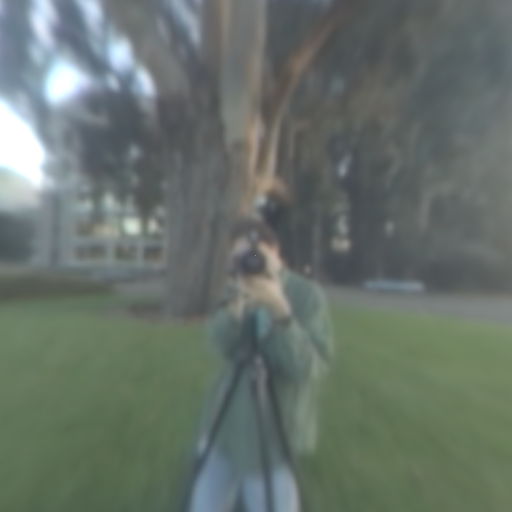 |
| empty_environment_light_probe | 0 | 21 | 21 | 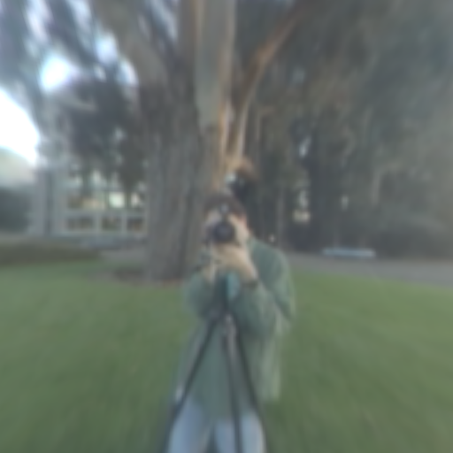 |
| audi-tt-pisa | 6,745 | 1,069,887 | 1,076,632 | 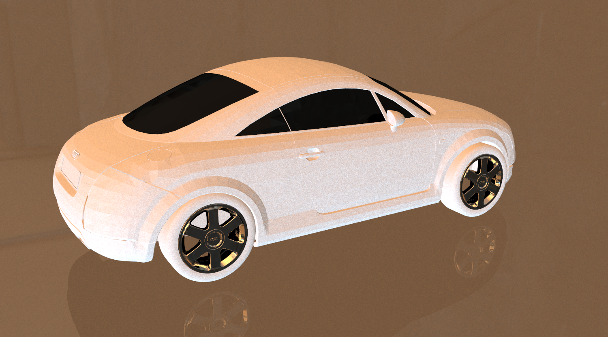 |
| audi-tt-glacier | 8,125 | 1,051,815 | 1,059,940 | 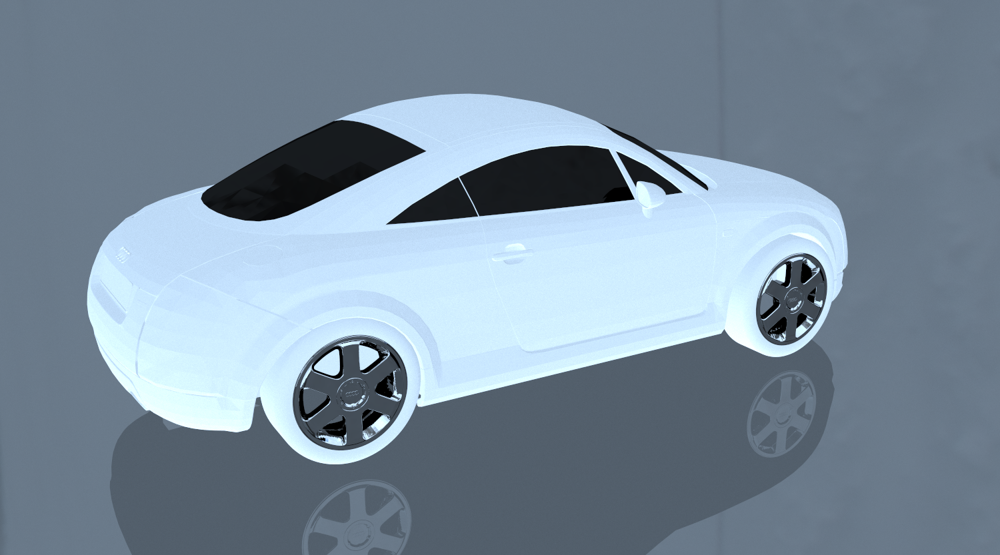 |

The Audi TT scenes are the slowest because they're complex car models with environment lighting. The simple cube scenes are fast because they're just basic geometry with simple lights.


# Final Thoughts

This was the final homework. After five homeworks, the raytracer can now handle:
- Meshes with BVH acceleration
- Transformations and instancing
- Materials (diffuse, specular, mirror, dielectric, conductor)
- Multiple light types (point, area, directional, spot, environment)
- Sampling and motion blur
- Depth of field
- Textures and bump mapping
- HDR rendering and tone mapping

Looking back at the funny stuff from HW1, we've come a long way. The renderer can now produce genuinely beautiful images with realistic lighting, proper HDR handling, and sophisticated tone mapping.

Although I couldn't find out why my audi looks weird, that's the one thing stays unresolved for this homework.
| Audi TT Groundtruth | My Weird Audi |
| --- | --- |
| 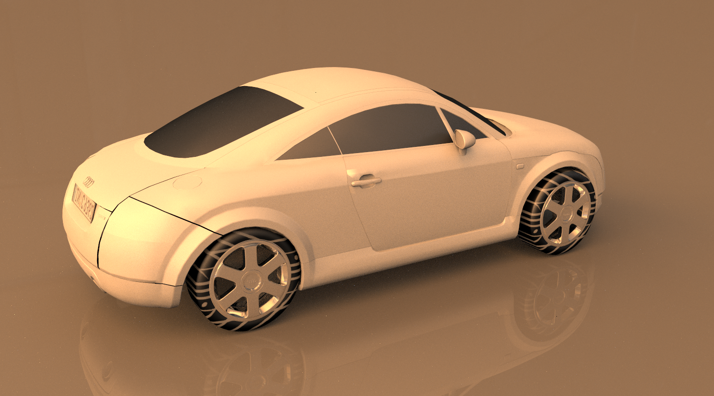 |  |

It's been a wild ride, full of bugs, fixes, and way too many hours debugging minus signs and pointer checks.

Until next time.