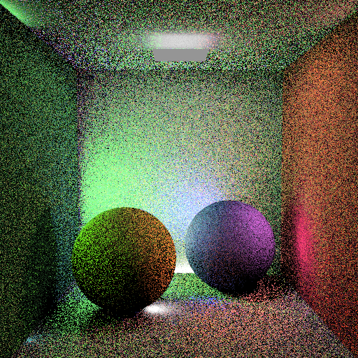
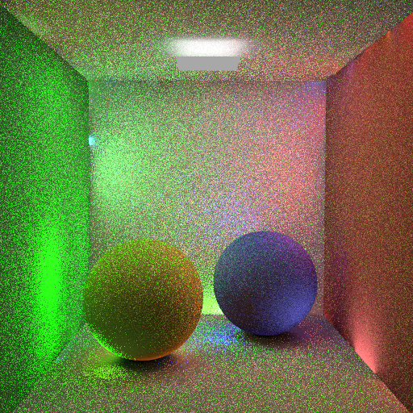
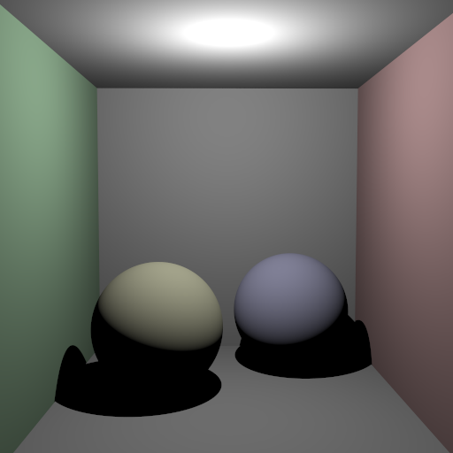
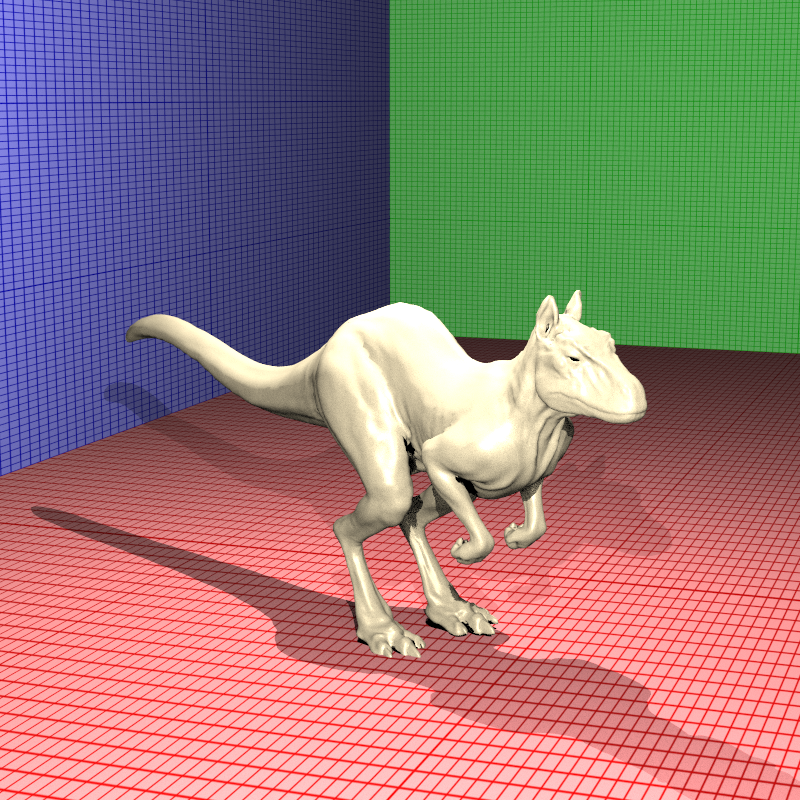

# My Raytracer Journey – Fall 2025 CENG 795 HW6 Blog

> **Murat Bayraktar – 2448199**

This is HW6 path tracing with BRDFs, object lights, and sampling. I originally expected HW5 to be the last one, but this homework pushed the renderer into full global illumination. I focused on getting the core pipeline working end-to-end (even if a few edge cases and scenes still need more tuning).

# TL;DR

### What I implemented
- Path tracing with BRDF evaluation (all 5 types)
- Object lights (LightSphere, LightMesh)
- Hemisphere sampling (uniform and cosine-weighted)
- Next Event Estimation (NEE)
- Multiple Importance Sampling (MIS) with balance heuristic
- Russian Roulette
- Splitting factor
- Sample clamping

### What I fixed
- Binary file parsing for Sponza scene (was loading 0 faces)
- Near-plane clipping bug (was clipping killeroo completely)
- LightMesh/LightSphere direct visibility (were appearing black)

### What still needs work
- Some cornellbox variants still deviate from ground truth
- TorranceSparrow BRDF is simplified (geometry/Fresnel terms could be improved)
- MIS is implemented with the balance heuristic only (not power heuristic)
- Some scenes still need extra validation/tuning

# The Path Tracing Journey

HW6 was a shift from Whitted-style ray tracing to path tracing. Previously, most lighting in my renderer came from a small number of specular bounces. With path tracing, indirect lighting becomes the default, which meant I had to make the whole pipeline robust against many bounces (and also debug a lot more NaNs/noise than I expected).

At a high level, the path tracing loop looks like this:
1. Intersect ray with scene
2. If hit light, add emission * throughput
3. Sample next direction (uniform or cosine-weighted)
4. Evaluate BRDF
5. Update throughput: throughput *= BRDF * cos(theta) / PDF
6. Create new ray and continue

Once I added NEE + MIS + Russian Roulette, the estimator became much less noisy, but it also became easier to break things by using inconsistent PDFs or missing an edge case (especially around emissive geometry).

# BRDF Evaluation: The Five Types

I implemented all five BRDF types:
- **OriginalBlinnPhong**: standard (N.H)^p
- **OriginalPhong**: (R.V)^p  
- **ModifiedBlinnPhong**: (N.H)^p * (N.L), with optional normalization
- **ModifiedPhong**: (R.V)^p * (N.L), with optional normalization
- **TorranceSparrow**: microfacet model with D, G, F terms (simplified version)

The TorranceSparrow implementation is simplified. A more complete version would need a more accurate geometry term and Fresnel evaluation, so I treat this part as “works for the scenes” rather than fully physically accurate.
# The Binary File Parsing Nightmare

The Sponza scene was rendering completely empty — no geometry at all. Turns out Sponza uses `_binaryFile` format instead of `_data` for VertexData, TexCoordData, and mesh Faces. The parser was skipping these entirely, resulting in meshes with 0 faces.

**Binary format discovered:**
- 4 bytes: count (little-endian uint32)
- count * N bytes: data (floats or ints)

I added support for reading binary files in `scene.cpp`:
- **VertexData**: `_binaryFile` : reads count + xyz floats per vertex
- **TexCoordData**: `_binaryFile` : reads count + uv floats per coordinate
- **Mesh Faces**: `_binaryFile` : reads count + 3 uint32 indices per triangle

Result: Sponza now loads correctly with 471,282 vertices and 393 meshes with proper face counts. But the rendering still has issues — more on that later.

# The Near-Plane Clipping Bug

The killeroo scene was rendering with the dinosaur completely invisible — only the walls were showing. Not "dark" — completely invisible. It looked like the dinosaur was not in the scene at all.

**Root cause:** The intersection code was using `nearDistance` as a clipping distance. For killeroo:
- Camera at Y=1.6, looking down (-Y direction)
- nearDistance = 1.8
- Killeroo top at Y=0.29, so distance from camera ≈ 1.3

Since 1.3 < 1.8, the entire killeroo was being clipped as "too close to camera"!

**The fix:** `nearDistance` defines the image plane for ray generation, NOT a clipping plane. Objects between the camera and image plane should still be visible. I removed the clipping logic, and killeroo now renders correctly with all 92,092 triangles visible.

# Object Lights: When Lights Are Also Objects

Object lights (LightSphere and LightMesh) are interesting — they're basically regular objects but with a Radiance field. They inherit from Object so they can have materials, transformations, textures, everything.

The tricky part was making them visible. For non-path-traced scenes using LightMesh or LightSphere, the light sources themselves weren't visible (appeared black).

**Two sub-fixes:**

1. **Return emission for direct hits:** In `computePixelColor`, check if the hit object is emissive and return its radiance directly.

2. **Disable back-face culling for LightMesh:** Light sources should be visible from both sides.

Result: LightMesh objects now appear as bright rectangles instead of black holes.

# Next Event Estimation and MIS

Next Event Estimation (NEE) samples lights directly, which reduces variance significantly. The function:
1. Selects a light uniformly from all available lights
2. Samples a point on that light (using area sampling for area lights, sphere sampling for LightSphere, mesh sampling for LightMesh)
3. Computes visibility
4. Converts area PDF to solid angle PDF
5. Returns radiance contribution and PDF

Multiple Importance Sampling (MIS) combines light sampling and BRDF sampling. I implemented the balance heuristic: w = pdf1 / (pdf1 + pdf2). One tricky part was handling the “BRDF-sampled ray hits an emissive object” case, since the corresponding light PDF needs to be computed consistently for good MIS behavior. My implementation is not perfect here, and this likely explains some remaining mismatch in the harder scenes.

# Russian Roulette and Splitting

Russian Roulette: After minRecursionDepth, compute survival probability based on throughput (max of RGB components, clamped to [0.01, 0.99]). If random number > survival probability, terminate path. Otherwise, scale throughput by 1/survivalProbability.

Splitting: At the first bounce (depth == 0), I spawn `splittingFactor` indirect samples from the first hit point, accumulate their contributions, and average them (divide by N). This reduced variance a bit in the early bounces, especially in the Cornell Box scenes.

Sample clamping: Applied in the rendering loop before averaging samples. Each sample is clamped to sampleMaxVal if specified.

# Results Gallery

Some of my renders from HW6:

| Scene | Image |
| --- | --- |
| Diffuse Cornell Box (Default) |  |
| Diffuse Cornell Box (Importance + NEE + MIS) |  |
| Cornell Box Jaroslav (Glossy) |  |

The diffuse cornell box scenes work reasonably well. The basic path tracing produces noisy but correct results, and adding importance sampling, NEE, and MIS reduces the noise significantly.

# What Didn't Work (Time Constraints)

I didn’t get time to fully validate every scene. Here are some cases that still have visible issues:

| Scene | Issue |
| --- | --- |
| Killeroo BlinnPhong |  |
| Sponza Path |  |

The killeroo scene renders, but the lighting doesn't quite match the ground truth. The BRDF evaluation might be off, or there could be issues with the sampling. The Sponza scene loads correctly now, but the path tracing produces results that don't match the expected output. I was able to get it rendering, but the result still has noticeable issues (most likely from BRDF/PDF consistency and sampling edge cases).

Some of the more advanced cornellbox scenes (like the ones with sphere lights or prism lights) also don't match perfectly. The core path tracing works, but the edge cases and optimizations need more work.

# Final Thoughts

This was a challenging homework. Path tracing is conceptually simple but getting all the details right is hard. I got the core ideas working:
- Basic path tracing loop
- BRDF evaluation
- Object lights
- NEE and MIS
- Russian Roulette and splitting

Some scenes work well and converge reasonably, but the more complex ones (Killeroo, Sponza, and a few Cornell variants) still show differences from the ground truth. If I had more time, I would focus on better validation of BRDF energy behavior and tighter PDF consistency for MIS.

Looking back, I'm happy I got the basic path tracing working. The renderer can now handle global illumination, which is a huge step forward. But there's still work to be done on the advanced features and edge cases.

It's been a wild ride.
