# Project Blog: Gaussian Splats to Volumetric Rendering

> **Murat Bayraktar** - 2448199


<p align="center">
  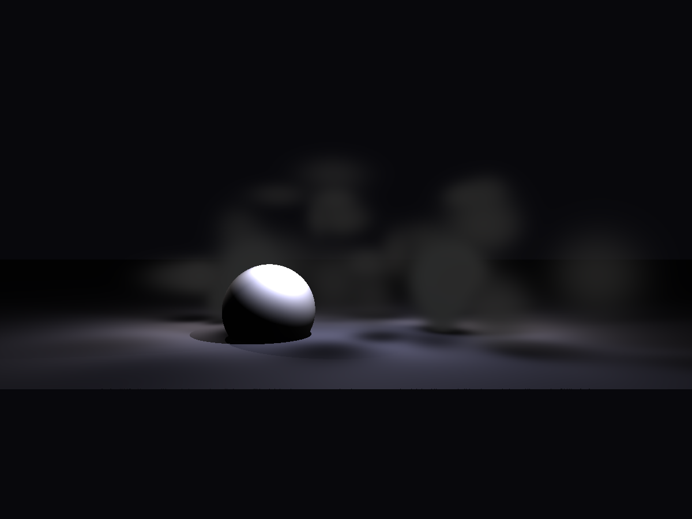
</p>

## Overview

The idea - initially - was to implement a hybrid rendering pipeline with Gaussian Splattings and Raytracing. I thought this would be a good idea because the Gaussian Splats give you speed and the raytracing of course bring fidelity. So ultimately I dreamt what everyone dreamt high reality with insane speed. However; that didn't go as planned because the it was flawed fundamentally and it required a deeper workload than I anticipated. Instead I implemented volumetric-ish raytracing. At leaast I wanted to show off a cool smoke effect :) 

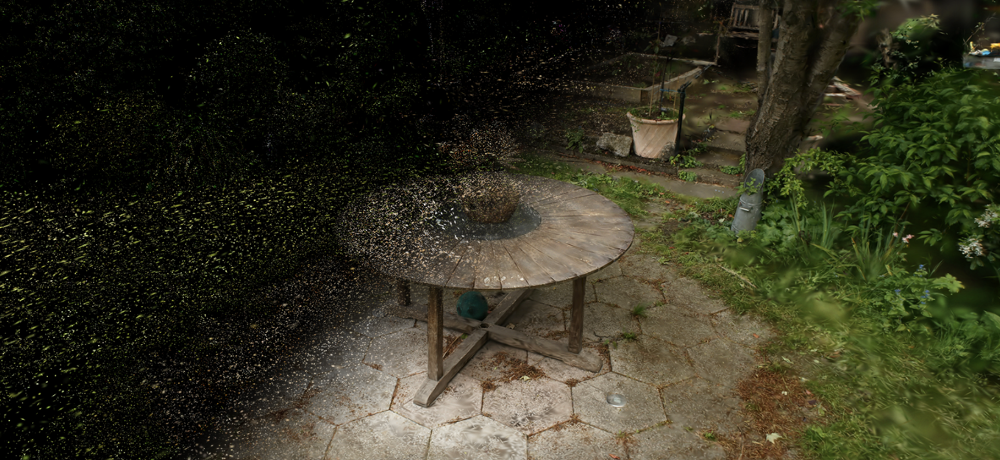

Before I dive into the project I want to outline briefly why that didn't work out as planned in the first place. The gaussian splats are trained in the following way:

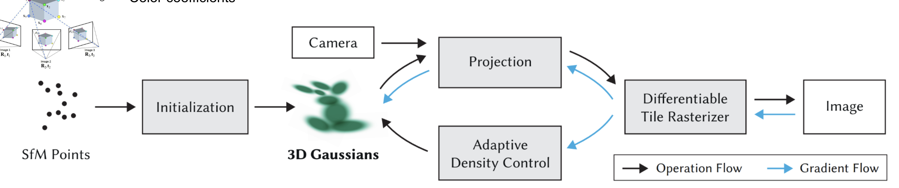

So to get the gaussian splats you first would need at least handful of reference images from different angles. For my case I wasn't sure 

1. If I should have downloaded reference images from internet and start working on them? (Then it would require extensive refactoring on my raytracer)
2. OR Use the current scenes then generate the dataset myself? (This required extensive work on the Gaussian Splatting side)

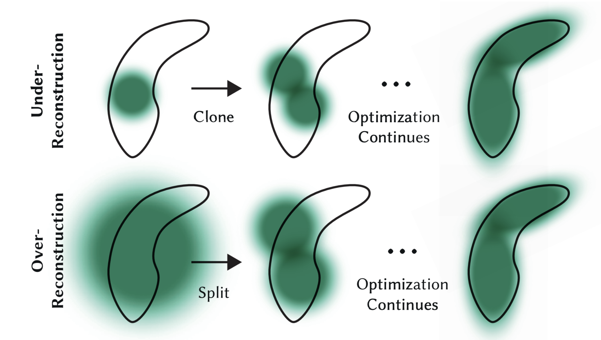

1 and 2 both had been tried and neither worked out in a reasonable amount of time because for instance for the latter -training splats- I'd need an Nvidia card. (My laptop has m2 apple chip).


So while trying these stuff out I already had Gaussians in my `scene.h`. Then I said "Okay, that won't work well but show must go on". Here are one of my initial attempts on rendering Gaussian primitives - god, they look scary :) 

| Some gaussian object | I have no idea | First cloudish stuff | Dark cloud |
| --- | ---- | ---- | ---- |
| 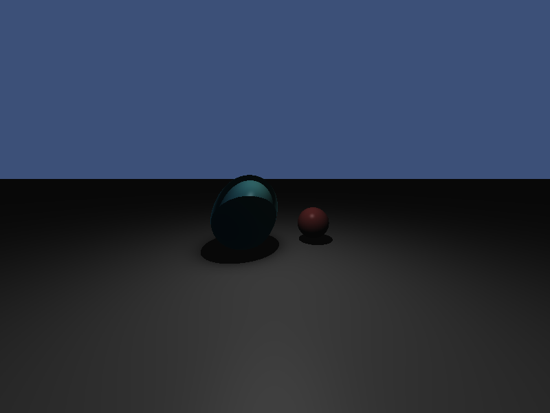 | 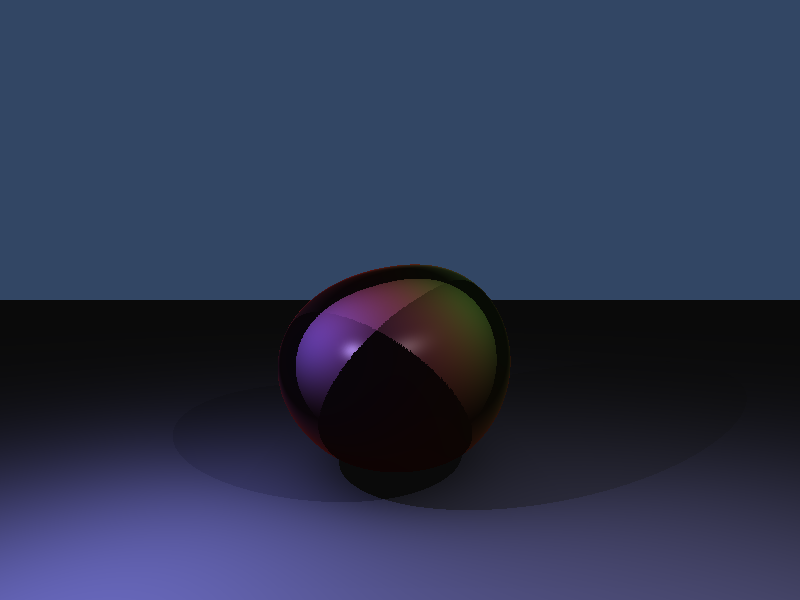 |  |  |


Ideally the project pivoted and now this project implements volumetric rendering using Gaussian fields integrated into a raytracer. The system allows rendering volumetric effects like smoke, clouds, fire, and fog by representing them as collections of 3D Gaussian primitives and using ray marching to accumulate density and color along rays.

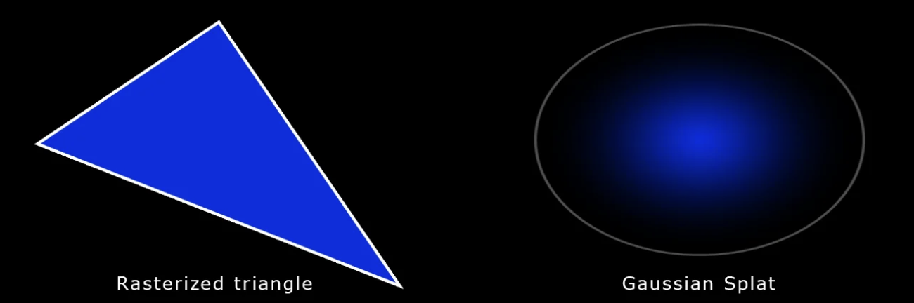

# Scene Files

My scene files are under [](./inputs/).
They contain extra fields for GaussianFields support:

## GaussianFields Array

The scene JSON includes a `"GaussianFields"` array at the root level (alongside `"Objects"`, `"Materials"`, etc.). Each entry in this array defines a GaussianField object with the following fields:

### GaussianField Fields

- **`_id`** (integer): Unique identifier for the GaussianField
- **`Material`** (integer): Material ID to use for shading
- **`renderMode`** (string, optional): Either `"surface"` or `"volumetric"` (default: `"surface"`)
  - `"surface"`: Treats the field as a solid surface using optical depth threshold
  - `"volumetric"`: Performs front-to-back alpha compositing for transparent volumes
- **`stepSize`** (float, optional): Ray marching step size (default: 0.01)
- **`tauHit`** (float, optional): Optical depth threshold for surface mode (default: 1.0)
- **`maxSteps`** (integer, optional): Maximum number of marching steps (default: 2048)
- **`shadowStepSize`** (float, optional): Coarser step size for shadow rays (default: 0.02)
- **`emissionStrength`** (float, optional): Multiplier for self-illumination in volumetric mode (default: 1.0)
- **`densityScale`** (float, optional): Multiplier for opacity accumulation (default: 1.0)
- **`Gaussians`** (array): Array of Gaussian primitives

### Gaussian Object Fields

Each entry in the `"Gaussians"` array defines a single 3D Gaussian with:

- **`mean`** (array of 3 floats): Center position [x, y, z]
- **`scales`** (array of 3 floats): Standard deviations along x, y, z axes [σx, σy, σz]
- **`color`** (array of 3 floats): RGB color [0,1]
- **`weight`** (float): Density/opacity multiplier

### Example

```json
"GaussianFields": [
  {
    "_id": 1,
    "Material": 1,
    "renderMode": "volumetric",
    "emissionStrength": 180.0,
    "densityScale": 2.2,
    "stepSize": 0.012,
    "tauHit": 1.0,
    "maxSteps": 4000,
    "shadowStepSize": 0.03,
    "Gaussians": [
      {"mean": [-5, 6, 0], "scales": [3.0, 2.2, 2.8], "color": [1.0, 0.98, 0.95], "weight": 2.5},
      {"mean": [-4, 7, 1], "scales": [2.5, 1.8, 2.2], "color": [1.0, 0.99, 0.96], "weight": 2.8}
    ]
  }
]
```


## Implementation

### Data Structures

The implementation defines two main structures in `scene.h`:

1. **`Gaussian` struct**: Represents a single 3D Gaussian primitive with:
   - `mean`: Center position (μ)
   - `scales`: Standard deviations along x, y, z axes (σx, σy, σz)
   - `color`: RGB color [0,1]
   - `weight`: Density/opacity multiplier
   - `invVariance`: Precomputed inverse variance (1/σx², 1/σy², 1/σz²) for optimization

2. **`GaussianField` struct**: Container for multiple Gaussians with rendering parameters:
   - `gaussians`: Vector of Gaussian primitives
   - `stepSize`: Ray marching step size (default 0.01)
   - `tauHit`: Optical depth threshold for surface mode (default 1.0)
   - `maxSteps`: Maximum marching steps (default 2048)
   - `shadowStepSize`: Coarser step size for shadow rays (default 0.02)
   - `renderMode`: Either "surface" or "volumetric"
   - `emissionStrength`: Multiplier for self-illumination
   - `densityScale`: Multiplier for opacity accumulation
   - `bounds`: Precomputed AABB for early-out optimization

### Density Evaluation

The core function `gaussianFieldDensity()` in `utils.cpp` computes the density at a point by summing contributions from all Gaussians:

```cpp
rho = Σ weight_i * exp(-0.5 * (d^T Σ⁻¹ d))
```

where `d = x - mean_i` is the distance vector and the exponent uses Mahalanobis distance. The function includes optimizations:
- Bounding box check: Skip Gaussians beyond 5-sigma distance
- Early termination: Skip if exponent > 25.0 (negligible contribution)

### Rendering Modes


#### Volumetric Mode (`renderMode = "volumetric"`)

The `rayMarchGaussianVolume()` function performs front-to-back alpha compositing:
1. Marches through the volume with `stepSize` increments
2. At each step, evaluates density and color using `gaussianFieldDensityAndColor()`
3. Computes alpha using Beer's law: `alpha = 1 - exp(-density * dt * densityScale)`
4. Accumulates color and opacity: 
   - `color += (1 - opacity) * alpha * emissionColor`
   - `opacity += (1 - opacity) * alpha`
5. Stops when opacity > 0.99 or max steps reached

The emission color is computed as `gaussianColor * emissionStrength`, allowing self-illuminated volumes like fire or nebulae.

### Shadow Rays

The `gaussianFieldTransmittance()` function computes light attenuation through volumes for shadow rays:
- Marches along shadow ray with coarser `shadowStepSize`
- Accumulates optical depth (tau)
- Returns transmittance: `T = exp(-tau)`
- Includes optimizations: skips low-density regions faster, limits max distance and steps

### Integration with Raytracer

In the main `intersect()` function:
1. For each GaussianField, checks if ray intersects the AABB bounds (early-out)
2. If `renderMode == "volumetric"`, calls `rayMarchGaussianVolume()` to accumulate volumetric contribution
3. If `renderMode == "surface"`, calls `rayHitsGaussianField()` for surface intersection
4. Stores volumetric color and opacity in the intersection record if present

The volumetric contribution is composited with surface shading in the shading function.

## Results

##### Some of my favorites are below:

#### Dragon

The dragon fire breath scenes showcase volumetric rendering at its finest, with fire and smoke emanating from the dragon model with proper self-illumination and shadowing. Here are multiple camera angles of the scene:

| Front View | Side View | Close-up |
| --- | --- | --- |
| 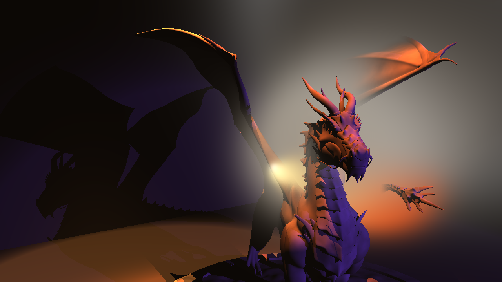 | 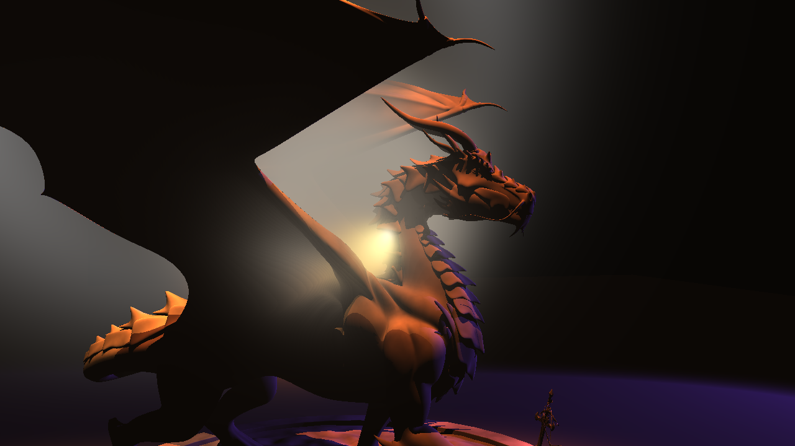 | 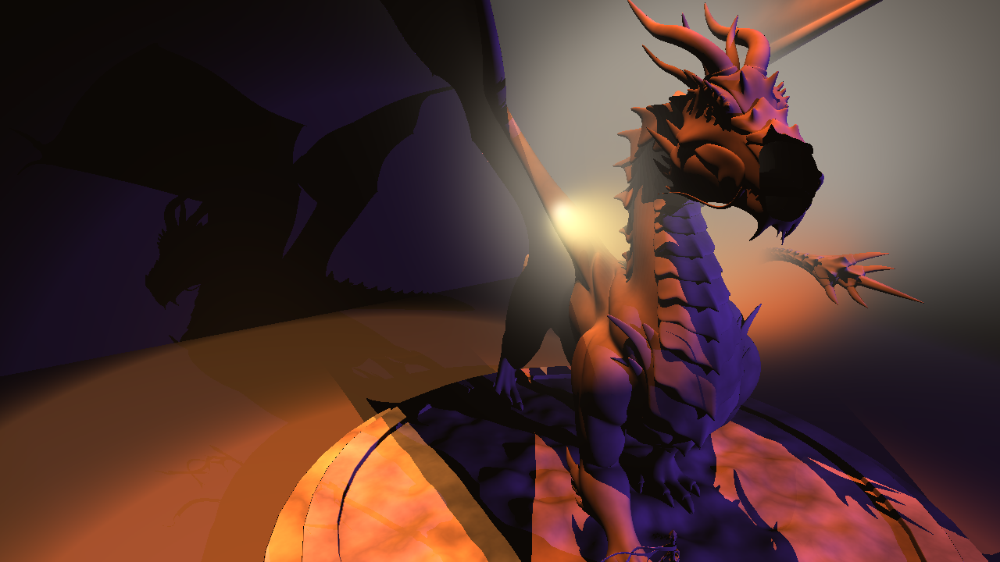 |

| Wide Front View | Aerial View | Head On |
| --- | --- | --- |
| 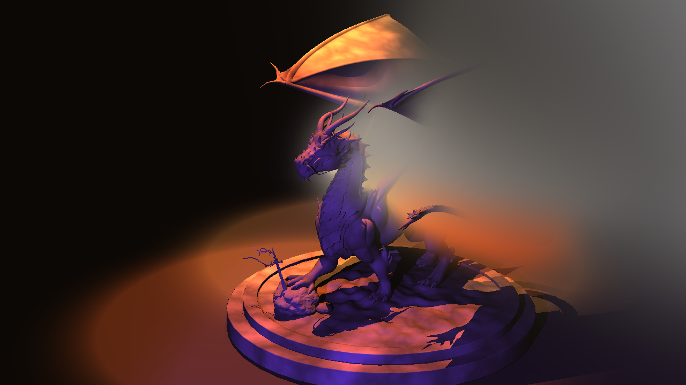 | 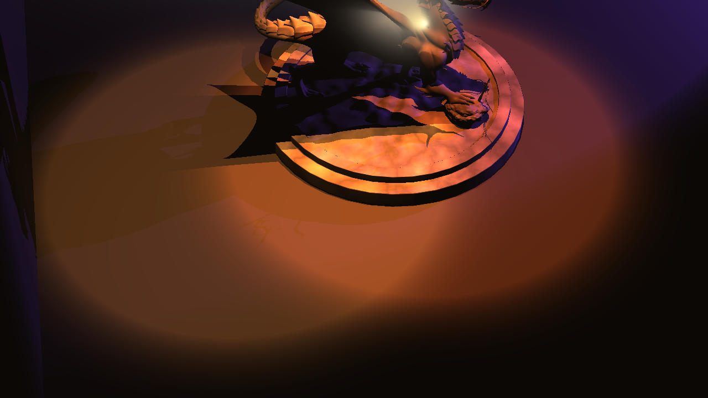 | 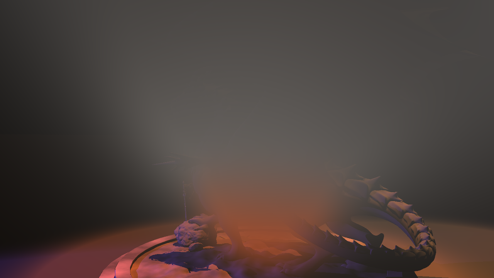 |

| Far Front | Wide Side |
| --- | --- |
| 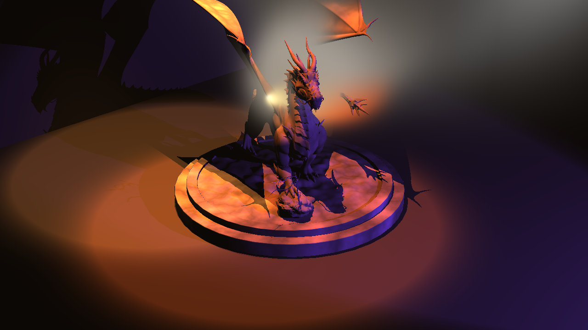 | 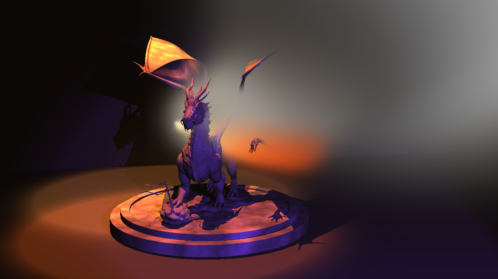 |

#### Artistic Stuff

Various artistic volumetric effects demonstrating different color palettes, densities, and compositions:

| Cosmic Nebula | Vortex Art | Ethereal Art |
| --- | --- | --- |
| 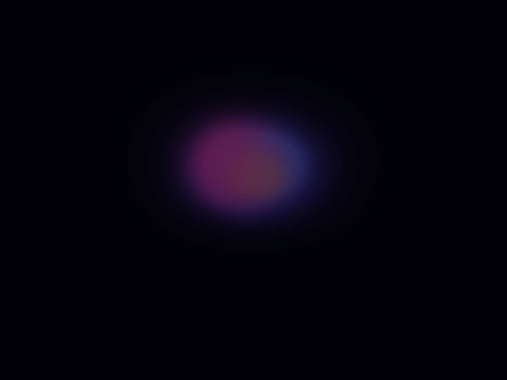 | 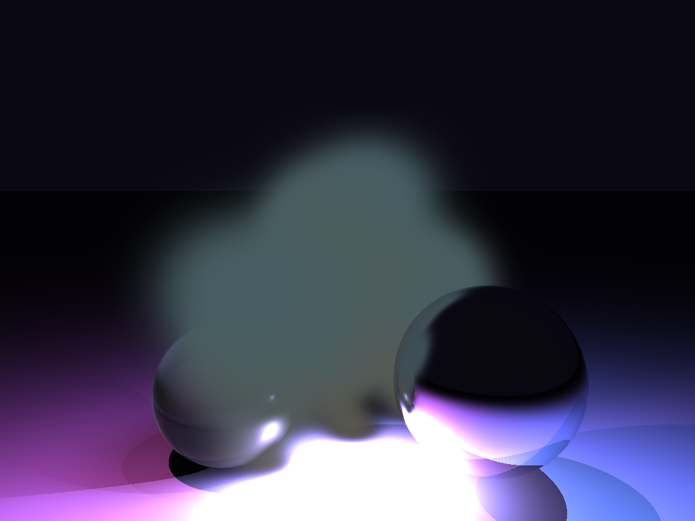 | 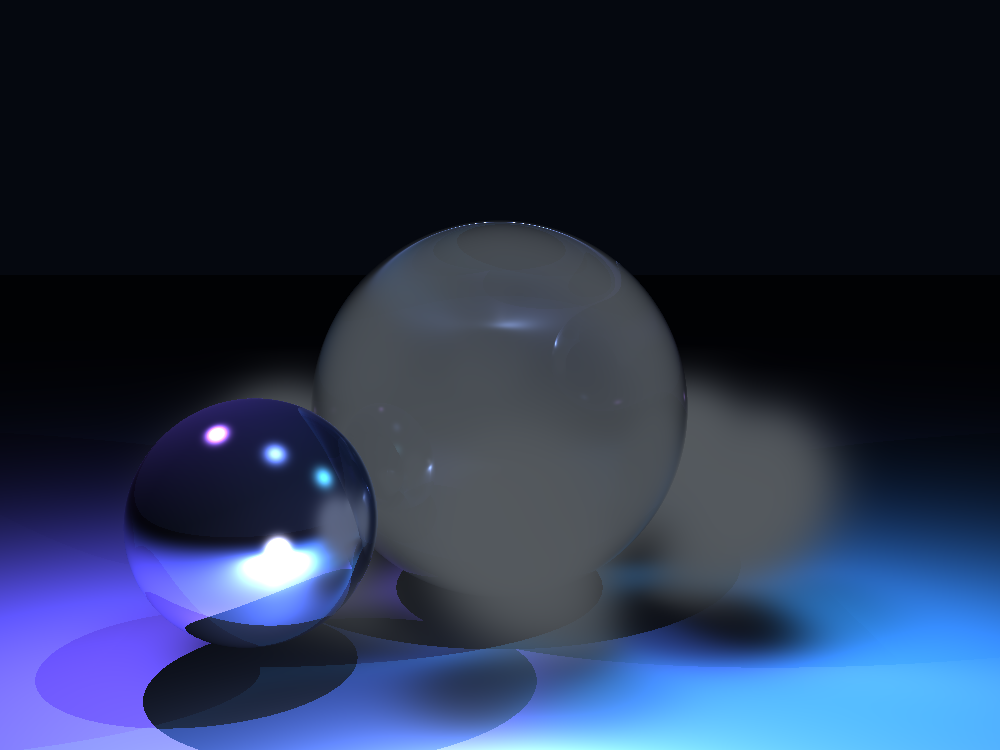 |

| Inferno Art | Storm Art | Colored Smoke |
| --- | --- | --- |
| 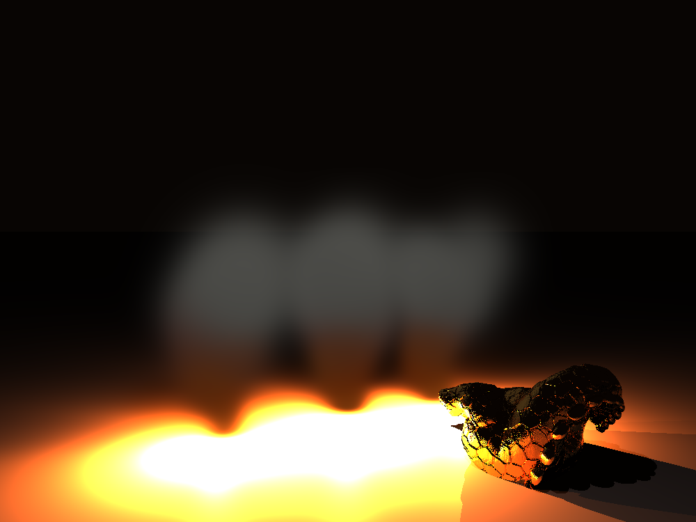 | 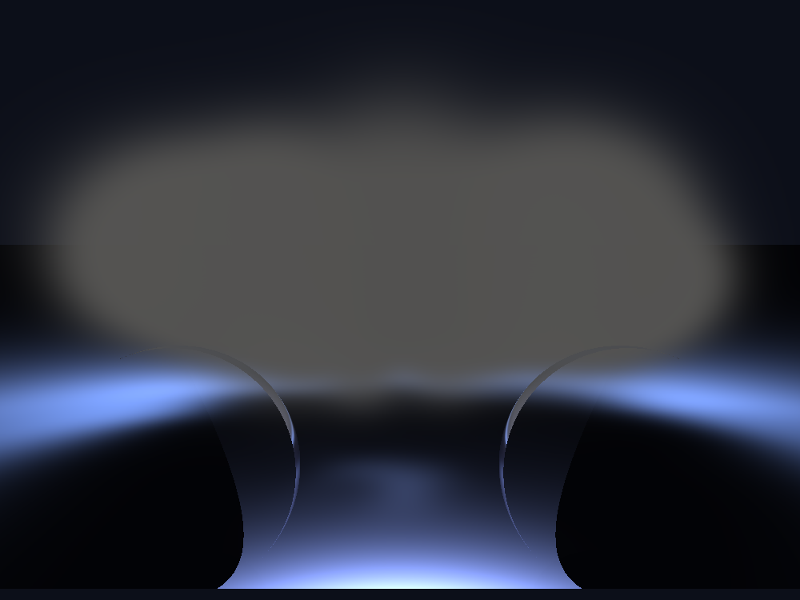 | 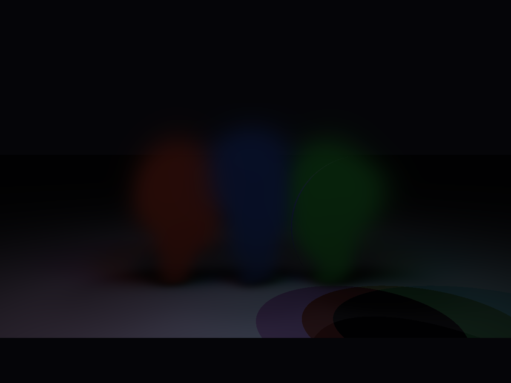 |

| Foggy Mystery | Bright Smoke | Smoke Rising |
| --- | --- | --- |
|  | 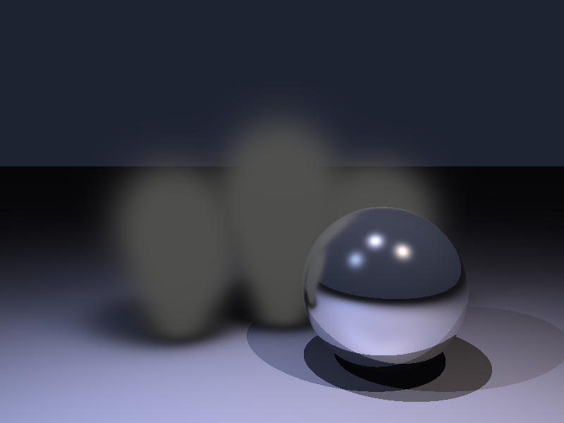 | 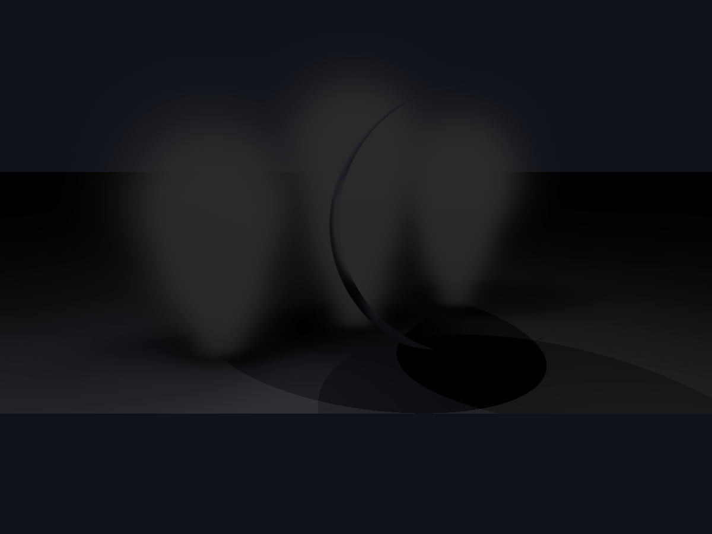 |


## Optimizations

1. **AABB Early-Out**: Each GaussianField has precomputed bounding box. Rays that don't intersect the AABB skip all processing.

2. **5-Sigma Cutoff**: Gaussians beyond 5 standard deviations contribute negligibly (< 3e-6), so they're skipped in density evaluation.

3. **Combined Density and Color**: `gaussianFieldDensityAndColor()` computes both in a single pass through Gaussians, avoiding duplicate distance calculations.

4. **Adaptive Shadow Stepping**: Shadow rays use larger steps in low-density regions (4x step size when density < 1e-6).

5. **Precomputed Inverse Variance**: Stored in Gaussian struct to avoid repeated division operations.

### Limitations

- Ray marching is computationally expensive, especially with many Gaussians
- Step size must be tuned per scene for quality vs. performance
- Volumetric shadows add significant overhead
- No adaptive step sizing based on density gradient

## Conclusion

The implementation successfully integrates volumetric rendering into the raytracer using Gaussian fields. I don't know if this is the right way in the industry - probably not but it was fun. It handles shadows correctly, and can represent various volumetric phenomena. 

The system is flexible enough to render clouds, smoke, fire, fog, and other atmospheric effects with proper light interaction and self-shadowing.
